

<b>Código, notebooks e instruções para rodar:</b> 
<a href="https://github.com/lucasnumaboa/visao-computacional-com-cnns-e-transformers">https://github.com/lucasnumaboa/visao-computacional-com-cnns-e-transformers</a> 
<code>git clone https://github.com/lucasnumaboa/visao-computacional-com-cnns-e-transformers.git</code> 
Ou abra cada notebook direto no Google Colab pelos botões "Abrir no Colab" do README (GPU T4 → Executar tudo).

<h1>Visão Computacional com CNNs e Transformers</h1>

Projeto de Disciplina: relatório técnico

<b>Aluno:</b> Lucas de Oliveira Ferreira 
<b>Instituição:</b> Instituto INFNET 
<b>Disciplina:</b> Visão Computacional com CNNs e Transformers [26E3_3] 
<b>Data:</b> outubro de 2026

# Sumário

1. Introdução e visão geral
2. Atividade 1: Vision Transformers em inspeção visual de qualidade (fundição)
3. Atividade 2: reconhecimento semântico em publicidade visual com CLIP (ADS-16)
4. Atividade 3: classificador com CNN pré-treinada (feature extraction)
5. Atividade 4.1: estudo de caso de COVID-19 em radiografias de tórax, com GAN condicional
6. Atividade 4.2: transfer learning para análise de tráfego urbano
7. Conclusões
8. Declaração de uso de Inteligência Artificial
9. Referências

# 1. Introdução e visão geral

Este relatório documenta as quatro atividades do Projeto de Disciplina. Em cada uma, o foco não é só fazer o código rodar, mas **decidir qual arquitetura usar, por quê, e como adaptá-la ao problema**, e depois verificar com dados se a decisão se sustenta. Cada atividade segue a mesma estrutura: definição do problema, decisões técnicas com justificativa, resultados com métricas e gráficos, e análise crítica.

| Atividade | Problema | Abordagem | Notebook |
|---|---|---|---|
| A1 | Detectar defeitos em peças fundidas (rotores de bomba) | Atenção e ViT **implementados módulo a módulo** (com testes), pesos ImageNet, fine-tuning, comparação com ViT do zero, Swin-T e ResNet-50, análise de atenção | `A1_vision_transformers.ipynb` |
| A2 | Extrair semântica de um corpus de anúncios sem treinar | CLIP ViT-B/32: ranking de conceitos com threshold calibrado, busca texto→imagem, alinhamento das modalidades e tokenização CLIP × BERT | `A2_clip_ads16.ipynb` |
| A3 | Classificar 7 categorias de objetos | ResNet-50 congelada + nova camada linear; teste de estresse para embasar as melhorias | `A3_cnn_kaggle.ipynb` |
| A4.1 | Diagnosticar e corrigir uma triagem de COVID-19 que "ignora positivos" | Diagnóstico, cGAN (DCGAN condicional) com ablação de estabilidade, experimento controlado de recall, plano e critério de adoção clínica | `A4_estudo_caso_raio_x.ipynb` |
| A4.2 | Diagnosticar um sistema de tráfego que falha em produção | Análise escrita (sem implementação) | — |

**Reprodutibilidade.** O código, os notebooks e as instruções estão em https://github.com/lucasnumaboa/visao-computacional-com-cnns-e-transformers (botão "Abrir no Colab" para cada notebook). Os quatro notebooks rodam do início ao fim no Google Colab com GPU T4, sem montar o Drive e sem credenciais. Os datasets são baixados do endpoint público do Kaggle (`/api/v1/datasets/download/<owner>/<dataset>`), com `kagglehub` como alternativa. Cada notebook informa no topo a memória e o tempo estimados, e fixa sementes aleatórias. Os resultados deste relatório vêm da execução completa dos notebooks numa GPU NVIDIA RTX 3050 (6 GB). O código detecta a VRAM disponível e mantém o mesmo batch efetivo por acumulação de gradiente, de modo que os números se reproduzem no T4.

**Alinhamento com a disciplina.** As técnicas usadas vêm das aulas: TorchVision Weights API e feature extraction (Aula 01), self-attention e bloco Transformer (Aula 02), receita de fine-tuning de encoders (Aula 03), ViT, CutMix e attention rollout (Aula 04), atenção por cabeça (Aula 05), CLIP e prompt ensembling (Aula 06), DCGAN/cGAN e estabilização (Aula 07), FID, calibração de threshold e protocolo de avaliação com dados sintéticos (Aula 08). Quando uma escolha foge do material das aulas, ela é justificada no texto.

# 2. Atividade 1: Vision Transformers em inspeção visual de qualidade (fundição)

## 2.1 Definição do problema

**Domínio: indústria, controle de qualidade.** O objetivo é classificar rotores de bombas submersíveis produzidos por fundição (vista superior) em **defeituoso** (`def_front`: porosidade, rebarbas, falhas de borda) ou **OK** (`ok_front`). Hoje a inspeção é manual, lenta e sujeita a fadiga, e deixar passar uma peça defeituosa (falso negativo) pode levar à rejeição de um lote inteiro. O tema se liga à minha atuação com ERP para indústria, em que os resultados de inspeção alimentam o módulo de controle de qualidade.

**Dataset:** *Casting Product Image Data for Quality Inspection* (Kaggle, CC BY-NC-ND 4.0). **Decisão:** usar só o subconjunto `casting_512x512`, com **1.300 fotos originais** (781 defeituosas e 519 OK). O conjunto 300×300, de 7.348 imagens, **já vem com augmentation aplicada** pelo autor, então dividi-lo colocaria versões da mesma peça no treino e no teste, um vazamento. Fizemos nosso próprio split estratificado 70/15/15 (910 / 195 / 195) e nossa própria augmentation, só no treino.

**Achado na exploração: um possível atalho.** As fotos foram tiradas sobre dois tipos de fundo. **79% das defeituosas estão sobre fundo cinza e 73% das OK sobre fundo branco.** Um modelo poderia acertar boa parte olhando só o fundo (*shortcut*, Aula 08). Por isso o split foi estratificado também por tipo de fundo, e o atalho foi testado explicitamente na seção 2.4.

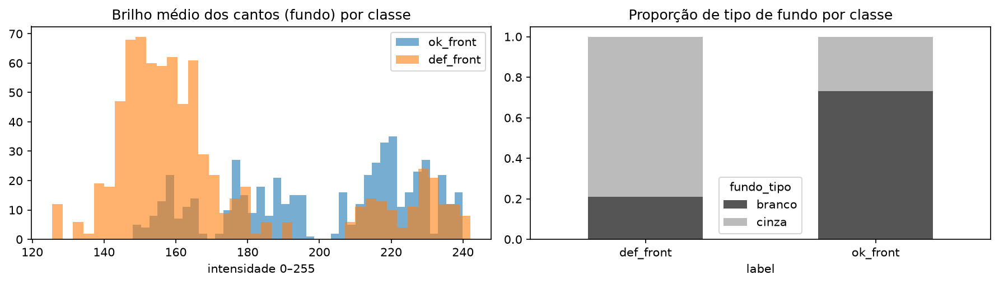

## 2.2 Decisões técnicas e justificativa

**Atenção do zero, em módulos testáveis (Aula 02).** Implementamos três módulos PyTorch:

- `ScaledDotProductAttention`: `softmax(QKᵀ/√d_k)·V`, com máscara opcional.
- `AttentionHead`: uma cabeça com **projeções W_Q, W_K, W_V próprias e independentes**.
- `MultiHeadAttention`: *h* cabeças independentes, **concatenação** e projeção `W_O`.

Seis testes automatizados (`assert`) passam:

| # | Teste | O que garante |
|---|---|---|
| 1 | formas `[B,T,D]` / `[B,h,T,T]` e linhas do softmax somando 1 | contrato do módulo |
| 2 | `ScaledDotProductAttention` = `F.scaled_dot_product_attention` | a fórmula está correta |
| 3 | `MultiHeadAttention` = `nn.MultiheadAttention` (pesos copiados cabeça a cabeça) | projeções por cabeça + concatenação + W_O corretas |
| 4 | posições mascaradas recebem peso 0 | o mecanismo de máscara (o mesmo da `attention_mask` do BERT) |
| 5 | `MHA(Px) = P·MHA(x)` | **equivariância a permutação**: sem PE, a atenção ignora a ordem |
| 6 | versão fundida usada no ViT = versão de cabeças independentes | o ViT usa exatamente esse mecanismo |

**Do bloco ao ViT (Aulas 02, 04 e 05):**

- `MultiHeadSelfAttention` é a versão **fundida** das mesmas cabeças: W_Q, W_K, W_V de todas as cabeças empilhadas numa `Linear(D, 3D)`. Faz 3 multiplicações grandes em vez de 3·h pequenas, no formato dos pesos do TorchVision. O teste 6 prova a equivalência.
- `PatchEmbedding`: `Conv2d(3, 768, 16, stride=16)`, que transforma a imagem de 224 px em 196 patches.
- `TransformerEncoderBlock` Pre-LN: `z' = MSA(LN(z)) + z` e `z = MLP(LN(z')) + z'`, com *feedforward* de duas camadas (`Linear(D,4D)` → GELU → `Linear(4D,D)`), dois `LayerNorm` e duas conexões residuais.
- `ViT`: token [CLS] aprendível + *position embeddings* aprendidos (197 × 768), *N* blocos, `LayerNorm` e cabeça `Linear(768, C)`. A saída são os logits.

**Positional encoding: por que é indispensável.** Pelo teste 5, a atenção trata os tokens como um **conjunto**. O [CLS] agrega os patches com pesos que dependem só do conteúdo, então uma imagem e a sua versão "quebra-cabeça embaralhado" produziriam **exatamente a mesma** representação. O modelo perderia vizinhança (contornos que atravessam patches) e localização (defeito na borda vs no cubo). O ViT soma `E_pos ∈ ℝ^(197×768)` aos tokens. O teste no ViT-B/16 real confirma, e mostra também que os embeddings 1D aprendidos recuperam a estrutura 2D:

| Patches embaralhados antes da posição | Máx. diferença no [CLS] | Cosseno original × embaralhada |
|---|---|---|
| **sem** E_pos | 0,000003 (arredondamento) | **1,000**: o modelo não percebe que a imagem foi desmontada |
| **com** E_pos | 3,51 | **0,15**: a representação muda completamente |

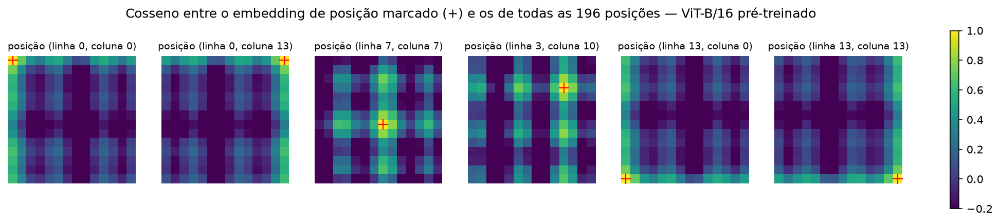

**Pré-treino dentro da implementação própria.** Os pesos `ViT_B_16_Weights.IMAGENET1K_V1` do TorchVision foram carregados **na nossa implementação** por mapeamento do `state_dict` (`in_proj` → `qkv`, `out_proj` → `proj`). A diferença máxima de logits em relação ao `torchvision.models.vit_b_16` foi de **3,8 × 10⁻⁶**. A arquitetura escrita **é** o ViT-B/16, e os pesos de atenção ficam acessíveis sem *hooks*.

**Por que ViT-B/16 pré-treinado e ajustado por fine-tuning:**

- A Aula 04 mostra que o ViT tem viés indutivo quase nulo e "fome de dados". O pré-treino em escala é o que o viabiliza com 910 imagens.
- A atenção global é natural para o problema: o defeito pode estar **em qualquer ponto do anel**, e o [CLS] pondera todos os patches desde o primeiro bloco.
- A explicabilidade é **nativa**: os pesos de atenção saem do próprio forward.
- A "regra de ouro" da Aula 04 (com poucos dados, prefira CNN) foi tratada como **hipótese a testar**, por isso o experimento E1 abaixo.

**Experimentos:**

| | Experimento | O que testa |
|---|---|---|
| E1 | ViT pequeno **do zero** (dim 192, 6 blocos, 3 cabeças, 2,9 M parâmetros), 40 épocas | Fome de dados do ViT |
| E2 | ViT-B/16 **congelado** + cabeça linear (*linear probe*) | Qualidade das features do ImageNet neste domínio |
| E3 | ViT-B/16 com **fine-tuning completo** | Adaptação ao domínio industrial |
| E4 | E3 **+ CutMix** | A regularização recomendada para ViT com poucos dados serve para defeitos locais? |
| E5 | **Swin-T** pré-treinado, fine-tuning | O que um Transformer hierárquico de janelas locais muda aqui |
| E6 | **ResNet-50** pré-treinada (CNN), fine-tuning | ViT vs CNN com o mesmo pré-treino, dados e receita |

**Hiperparâmetros de fine-tuning (E3) e por quê:**

| Hiperparâmetro | Valor | Justificativa |
|---|---|---|
| LR backbone / cabeça | 3e-5 / 1e-3 (AdamW) | Faixa 2e-5–5e-5 evita *catastrophic forgetting* (Aula 03). A cabeça nova precisa de LR maior (Aula 08). |
| Warmup + cosine | 1 época | Protege o backbone dos gradientes da cabeça aleatória no início. |
| Épocas / seleção | 10 / maior balanced accuracy de validação | As classes são 60/40 e os erros têm custo assimétrico. |
| Weight decay / clipping | 0,05 / 1,0 | Regularização padrão de fine-tuning de ViT. |
| Batch efetivo | 32 | Micro-batch 16 + acumulação em GPUs com menos de 10 GB, para reproduzir a dinâmica do T4. |
| Augmentation | Grupo **D4** (rotações de 90°, flips) + brilho/contraste | A peça é circular e vista de cima, então o rótulo é invariante. As transformações são **sem perda** (sem cantos pretos de rotação arbitrária). Sem recorte, que pode remover o defeito de borda. |

## 2.3 Resultados

| Experimento | Parâm. treináveis | Tempo | Val bal. acc | Teste acc | Teste bal. acc | Recall defeito (teste) | Escapes / refugos | AUC teste |
|---|---|---|---|---|---|---|---|---|
| E1: ViT do zero | 2,86 M | 133 s | 0,833 | 78,5% | 79,9% | 72,6% | 32 / 10 | 0,857 |
| E2: linear probe | 1.538 | 9 s | 0,987 | 96,9% | 97,2% | 95,7% | 5 / 1 | 0,994 |
| **E3: fine-tuning** | 85,8 M | 182 s | **1,000** | **100%** | **100%** | **100%** | **0 / 0** | **1,000** |
| E4: fine-tuning + CutMix | 85,8 M | 185 s | 0,996 | 99,0% | 99,1% | 98,3% | 2 / 0 | 0,999 |
| E5: Swin-T, fine-tuning | 27,5 M | 130 s | 0,996 | 99,0% | 99,1% | 98,3% | 2 / 0 | 0,999 |
| E6: ResNet-50, fine-tuning | 23,5 M | 92 s | 0,996 | 99,5% | 99,6% | 99,1% | 1 / 0 | 1,000 |

A escolha do modelo foi feita **pela validação, entre os ViTs (E1–E4)**: o escolhido é o E3. O teste dos demais é reportado só para comparação.

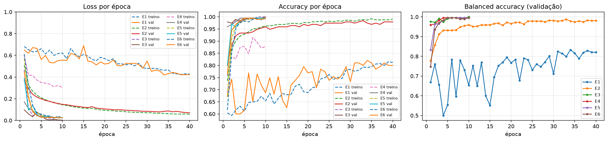

**Teste do modelo escolhido (E3):**

Accuracy <b>100%</b> Balanced accuracy <b>100%</b> Recall defeito <b>100%</b> AUC <b>1,000</b> Escapes (FN) <b>0/117</b> Refugos (FP) <b>0/78</b>

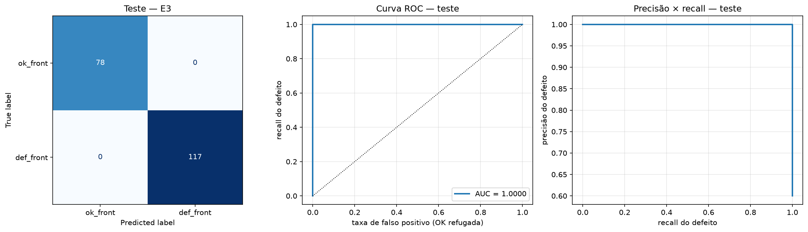

**Leitura do resultado.** 100% em 195 imagens significa, pela regra de três, **taxa de erro abaixo de ~1,5%** (IC 95%), e não erro zero. A validação também está saturada, então não há como refinar o limiar com estes dados. Baixá-lo só acrescenta refugos:

| Limiar | Recall defeito | Escapes | Refugos |
|---|---|---|---|
| 0,5 | 100% | 0 | 0 |
| 0,2 | 100% | 0 | 1 |
| 0,05 | 100% | 0 | 2 |
| 0,01 | 100% | 0 | 6 |

Um limiar operacional, definido pelo custo de um escape contra o de um refugo, exige uma validação maior.

## 2.4 Visualização e interpretação dos pesos de atenção

Os mapas mostram `A[:, h, 0, 1:]`: quanto o [CLS] da cabeça *h* pondera cada um dos 196 patches. O mapa é reorganizado em 14×14, ampliado por interpolação bilinear e sobreposto com alfa 0,5 (Aulas 05/08).

### ViT treinado do zero (E1): regiões emergentes

![ViT do zero: atenção do [CLS] nas 3 cabeças do bloco 6, média do bloco 3 e rollout.|92%](../figs/A1/06a_atencao_vit_do_zero.png)

- **Surgem detectores locais.** Mesmo com 910 imagens, nas peças defeituosas as 3 cabeças do bloco 6 produzem pontos nítidos sobre o **anel externo**, e em várias peças (por exemplo, a do furo no topo) caem sobre o defeito. O **rollout forma um anel** em torno do cubo: o modelo descobriu sozinho a geometria circular da peça.
- **Nas peças OK a atenção é difusa e invade o fundo.** As cabeças 0 e 2 cobrem o fundo branco, e as probabilidades ficam incertas (0,20–0,29). É sinal de que o modelo usa **fundo e iluminação global** como pista, justamente o atalho correlacionado com a classe. Sem pré-treino, o ViT pequeno mistura evidência local com contexto, e por isso deixa escapar 32 defeitos e refuga 10 peças boas.

### ViT pré-treinado e ajustado (E3)

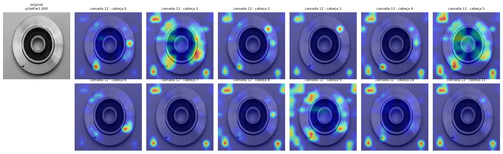

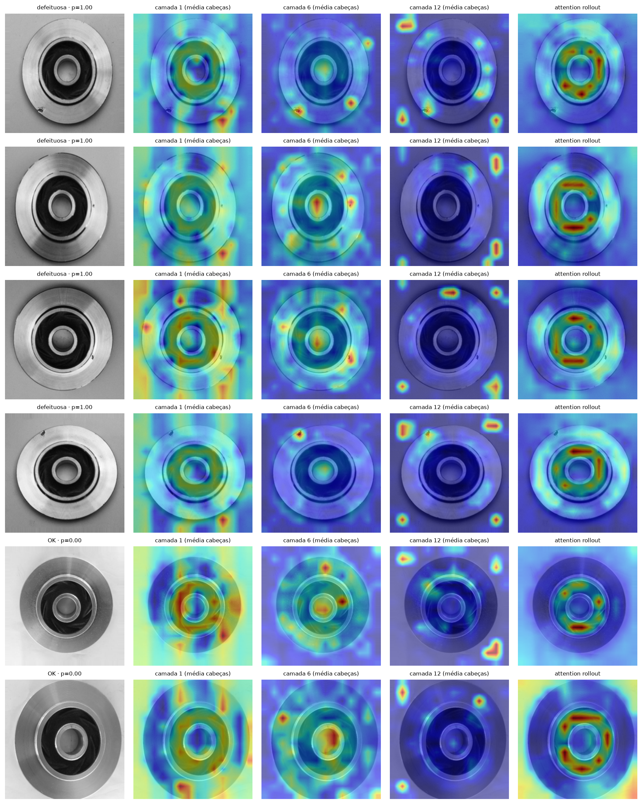

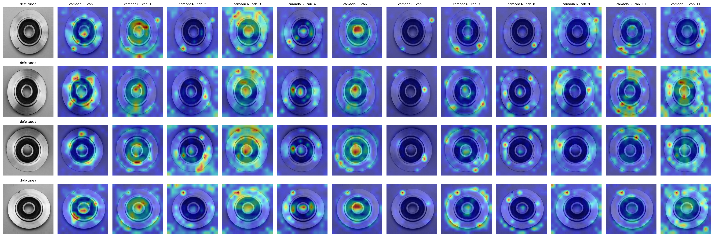

**O que o modelo aprende a ponderar, por profundidade:**

- **Camada 1:** atenção difusa e local, em faixas que acompanham bordas e contrastes (baixo nível).
- **Camada 6: é onde o defeito aparece.** Várias cabeças (por exemplo 2, 6 e 10) concentram a atenção em **pontos isolados do anel externo** que coincidem com furos e falhas de borda. Na peça com o furo no topo, as cabeças 2, 4, 6, 9, 10 e 11 marcam exatamente o furo. Há **divisão de trabalho entre cabeças**, como na Aula 05: a cabeça 5 se especializa no **cubo central** e a cabeça 0 contorna o **anel das pás**.
- **Camada 12: defeito + "registradores".** Na peça com falha de borda, as cabeças **0, 2, 4, 5 e 9** marcam exatamente a falha. Ao mesmo tempo, quase todas as cabeças põem parte da atenção em **3 a 5 patches de fundo nos cantos**. A cabeça 7, a mais concentrada (entropia de 3,07 nats, contra 5,28 se fosse uniforme), põe **69% da atenção nos cantos** nas peças defeituosas e 47% nas OK, contra 20% esperados pela área.

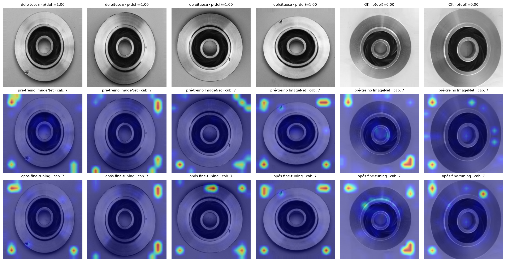

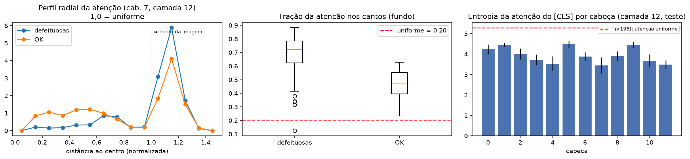

**A atenção nos cantos é atalho de fundo? Dois testes:**

1. **Origem do padrão.** A atenção nos cantos **já existe no ViT pré-treinado no ImageNet**, antes de ver qualquer peça. É o fenômeno de Darcet et al. (2024, *Vision Transformers Need Registers*): ViTs supervisionados reaproveitam patches de fundo, de baixa informação, como memória global.
2. **Contrafactual.** Pintamos os cantos (fora do círculo inscrito) de **branco** e, depois, de **cinza**, sem tocar na peça:

| Cenário | Accuracy | Recall defeito | Especificidade | Predições alteradas |
|---|---|---|---|---|
| original | 100% | 100% | 100% | — |
| cantos brancos | 97,4% | 95,7% | 100% | 5 |
| cantos cinza | 97,9% | 96,6% | 100% | 4 |

Branco e cinza têm efeitos na mesma direção e de tamanho parecido, então **a cor do fundo não decide a classe**. Mas apagar a região dos cantos, com qualquer cor, faz o modelo perder alguns defeitos: os "registradores" guardam informação agregada que o [CLS] usa. O E3 acerta 100% nos quatro subgrupos classe × tipo de fundo.

**Conclusão da interpretação:** o modelo **decide olhando a peça** (a camada 6 e algumas cabeças da 12 localizam o defeito), mas usa a região do fundo como memória. Uma mudança de fundo em produção (outra bancada, outro enquadramento) é um risco real que precisa ser testado antes da implantação.

## 2.5 Pré-treino do BERT × pré-treino do ViT: o que cada um maximiza

Os dois são encoders Transformer quase idênticos (Aula 03): mesmo bloco Pre-LN, 12 camadas, D = 768, 12 cabeças, [CLS] e posições aprendidas. A diferença está no **objetivo de pré-treino**:

| | **BERT** (texto) | **ViT** original (imagem) |
|---|---|---|
| Supervisão | **Auto-supervisionada**: o rótulo é o próprio texto | **Supervisionada**: rótulos humanos (ImageNet-21k / JFT-300M) |
| O que maximiza | **MLM**: `Σ log P(token mascarado | contexto bidirecional)` em 15% dos tokens, + **NSP** | `log P(classe | imagem)` sobre o [CLS] (cross-entropy) |
| O que a representação captura | Contexto e semântica **de cada token**: sintaxe, sentido, co-referência | Features **discriminativas para a taxonomia de rótulos**. O que não ajuda a separar classes é descartado. |
| Dados | Texto bruto (3,3 B palavras), sem anotação | Centenas de milhões de imagens **rotuladas** |

**Consequências observadas neste trabalho:**

- O ViT supervisionado não precisa de atenção espacialmente interpretável, só de um [CLS] separável. Por isso a última camada usa patches de fundo como memória global, o artefato de "registradores" da seção 2.4.
- A "versão BERT" da visão (**MAE/BEiT**: mascarar 75% dos patches e **reconstruí-los**) e a auto-destilação (**DINO**) produzem representações mais genéricas e mapas de atenção que segmentam o objeto (Aula 05).
- O **CLIP** (A2) maximiza o alinhamento imagem–texto (InfoNCE).
- Para defeitos, que são texturas fora da taxonomia do ImageNet, um backbone auto-supervisionado (DINOv2/MAE) tende a transferir melhor.

## 2.6 DeiT e Swin: o que resolvem que o ViT original não resolve

A Aula 05 lista três barreiras do ViT original: **fome de dados**, **escala única** (grade 14×14 em todas as camadas) e **custo O(N²)**.

- **DeiT (Touvron et al., 2021): fome de dados.** Treina o ViT **só no ImageNet-1k**, sem JFT, com augmentation pesada (RandAugment, Mixup, CutMix) e **destilação por token**: um token `[DIST]` imita uma CNN professora congelada. A destilação *hard* funciona melhor que a soft. Assim o ViT herda o viés de localidade da CNN sem tê-lo na arquitetura (top-1 de 79,9% para 85,2%). **Aqui:** seria a forma de treinar um ViT com poucas peças sem depender de pré-treino gigante. O E1 (ViT do zero) mostra o tamanho do problema que o DeiT ataca.
- **Swin (Liu et al., 2021): escala e custo.**
  - Atenção dentro de **janelas locais** M×M (M = 7), com custo **linear** no número de patches.
  - **Janelas deslocadas** a cada bloco (*cyclic shift* + máscara), para que janelas vizinhas troquem informação.
  - **Patch merging**, que gera uma pirâmide H/4 → H/32 e dá features multi-escala, como uma CNN.

  **Aqui:** permite entrada em 512 px, preservando defeitos de poucos pixels sem OOM, e features multi-escala para **localizar** o defeito. O E5 testa o Swin-T com a mesma receita.

## 2.7 Quando ViT supera CNN, e quando não: evidência neste domínio

Os três modelos pré-treinados foram ajustados com **a mesma receita** (E3, E5, E6, na tabela da seção 2.3):

- **Com pré-treino, as três arquiteturas empatam.** ViT-B/16 teve 0 erros, ResNet-50 teve 1 e Swin-T teve 2, em 195 imagens: diferença dentro do ruído amostral. Aqui, **o pré-treino importa muito mais que a arquitetura**.
- **Sem pré-treino, o ViT colapsa** (78,5%). É a "regra de ouro" da Aula 04: com poucos dados, o viés indutivo da CNN (localidade, equivariância) é uma vantagem, e o ViT só a compensa com pré-treino em escala ou destilação (DeiT).
- **CNN é preferível** para **inspeção em linha com hardware restrito** (PC industrial, *edge*): a ResNet-50 entrega o mesmo resultado com **¼ dos parâmetros** e metade do tempo de treino. Também se os dados fossem ainda mais escassos e não houvesse pré-treino adequado.
- **ViT/Swin são preferíveis:**
  - quando a **explicabilidade** importa: o ViT aponta o defeito na atenção sem custo extra;
  - quando há **mais dados**: pela curva de escala da Aula 04, com pré-treino maior o ViT passa a CNN;
  - (Swin) quando é preciso **subir a resolução** ou **localizar/segmentar** o defeito: custo linear e features multi-escala.
- **Escolha para este domínio:** o **ViT-B/16 pré-treinado**. Teve o melhor resultado, dentro do empate técnico, e é o único com mapas de atenção nativos que apontam o defeito. Para implantação embarcada, a ResNet-50 é a alternativa de menor custo com a mesma acurácia.

## 2.8 Análise crítica

- **O pré-treino é o fator dominante.**
  - Do zero, o ViT chega a 0,83 de balanced accuracy na validação e 78,5% no teste.
  - Congelado, com 1.538 parâmetros treinados, chega a 0,987 na validação.
  - Com fine-tuning, chega a 1,000 na validação e 100% no teste.
- **CutMix não ajudou, e a hipótese se sustenta.** O E4 teve 2 escapes contra 0 do E3, e accuracy de treino muito menor (0,88), por causa dos rótulos misturados inconsistentes. Em **anomalias locais**, o rótulo proporcional à área é semanticamente errado.
- **Arquitetura vs pré-treino.** ViT, Swin e ResNet-50 pré-treinados empatam (0–2 erros). A arquitetura importa menos que o pré-treino e que o protocolo de avaliação.
- **Limitações:**
  - teste de 195 imagens (erro < 1,5% com 95% de confiança, não erro zero);
  - validação saturada, sem limiar operacional;
  - correlação fundo↔classe inerente ao dataset, e o modelo é sensível a alterações na região do fundo (contrafactual).
- **O que eu mudaria:**
  1. Padronizar o fundo na captura, ou segmentar a peça e mascarar o fundo antes de classificar.
  2. Ampliar a validação para definir o limiar por custo.
  3. Usar ViT/DINOv2 **com register tokens**, para mapas de atenção limpos.
  4. Usar Swin ou resolução de 384–512 px para defeitos de poucos pixels.
  5. Em produção, enviar os casos com probabilidade intermediária para inspeção humana.

# 3. Atividade 2: reconhecimento semântico em publicidade visual com CLIP (ADS-16)

## 3.1 Definição do problema

Extrair inteligência semântica do corpus de imagens do **ADS-16** (Roffo & Vinciarelli, 2016) **sem treinar nenhum modelo**: só embeddings pré-treinados do CLIP e consultas em linguagem natural. São duas tarefas:

- **2.1:** ranking dos objetos e conceitos mais presentes no corpus, com um threshold justificado.
- **2.2:** busca de imagens a partir de consultas em texto.

**O corpus real difere do enunciado, e isso foi tratado explicitamente:**

1. O ADS-16 publicado tem **300 anúncios em 20 categorias** (15 por categoria), não 16. Os nomes das categorias foram extraídos da Tabela 1 do artigo original, que acompanha o dataset.
2. Como só há 300 anúncios, nenhum subconjunto só de anúncios chega a 500 imagens. O corpus do ADS-16 também inclui **~1.200 fotos que os 120 participantes enviaram** como imagens de que gostam (positivas) ou que os repulsam (negativas). Cada foto tem uma **legenda escrita pelo próprio participante**.
3. Cada foto aparece **duas vezes** no pacote: o original e uma miniatura `_th_`, com bytes diferentes que o MD5 não detecta. As miniaturas foram descartadas.

**Corpus final: 1.501 imagens**, sendo 301 anúncios, 611 fotos positivas e 589 negativas. Todas as análises são reportadas também **por origem**.

## 3.2 Decisões técnicas

| Decisão | Escolha | Justificativa |
|---|---|---|
| Modelo | **CLIP ViT-B/32**, pacote `clip` da OpenAI | Modelo das Aulas 06/08. Espaço conjunto de 512 dimensões, leve para o T4. |
| Embeddings | Normalizados em L2 e guardados em cache | Com a norma L2, o produto escalar é a *cosine similarity* (Aula 06). |
| Vocabulário | **24 conceitos**: pessoas, produtos, veículos, cenários, animais, dinheiro, elementos de anúncio | Cobre o que aparece em publicidade e em fotos pessoais. |
| Prompts | **Ensemble de 4 templates** por conceito ("a photo of {}", "an image showing {}", "a picture containing {}", "an advertisement featuring {}") | Na Aula 06, o ensemble supera o template único e a palavra solta. |
| Threshold τ | **Percentil 95 de pares negativos aleatórios** (Aula 08) | Detalhado abaixo. |
| Busca | `torch.topk` sobre `IMG @ query.T` | Receita do notebook da Aula 06. |

**Sanidade do espaço de embeddings.** Antes de confiar no CLIP, classificamos os 300 anúncios em 20 categorias **zero-shot**. O resultado foi **59,8% no top-1 e 76,7% no top-3**, contra 5% ao acaso. O heatmap conceito × categoria mostra associações coerentes:

- Automotive ↔ *car*
- Pet Supplies ↔ *animal*
- Jewelery ↔ *jewelry/watch*
- Health & Beauty ↔ *cosmetics*
- Grocery ↔ *food/drink/bottle*
- Baby ↔ *child*
- Social Dating ↔ *person/woman/man*

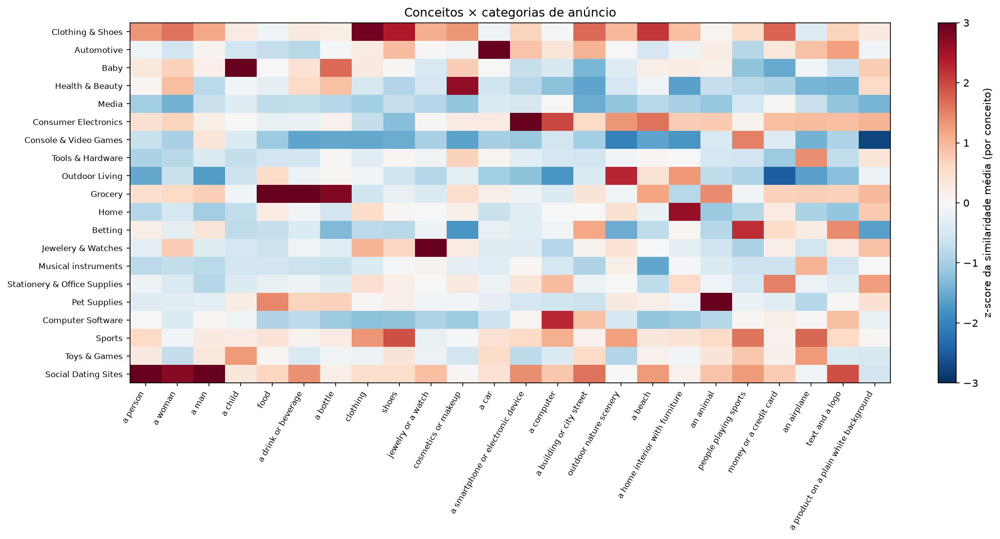

### Calibração do threshold

A *cosine similarity* do CLIP **não é probabilidade** e vive numa faixa estreita (Aula 08: ruído de 0,12 a 0,22, forte a partir de 0,28). Usamos as **legendas dos participantes**, que são ~1.200 pares imagem–texto reais escritos por humanos:

- **positivos:** foto × a própria legenda;
- **negativos aleatórios:** foto × legenda de outra foto, num total de 1,4 milhão de pares.

As legendas recebem os mesmos 4 templates dos conceitos, para que as escalas sejam comparáveis. **τ = P95 dos negativos = 0,234**: aceita 87% dos pares verdadeiros (mediana 0,281) e só 5% dos falsos (mediana dos negativos 0,191).

**Uma calibração descartada, e a lição.** A primeira tentativa comparou os anúncios com as 19 categorias erradas ("an advertisement for {categoria}"). Ela gerou τ = 0,274, com o qual praticamente nenhum conceito passava. A causa é que todo prompt "an advertisement for…" compartilha com qualquer anúncio o componente "isto é um anúncio", o que infla também os negativos (mediana de 0,238). **Calibrar com pares que não representam a tarefa produz um threshold inútil.**

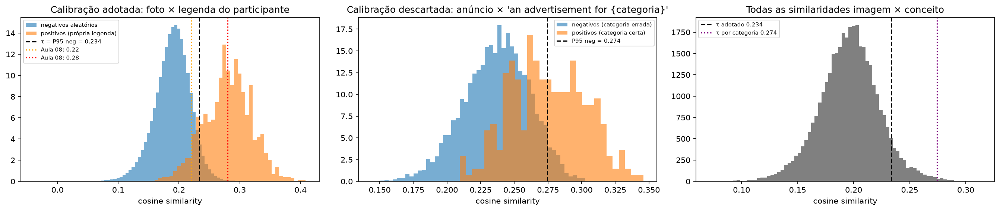

## 3.3 Resultados do item 2.1: ranking

| # | Conceito | Frequência (cos ≥ 0,234) | n imagens | Score médio nas presentes |
|---|---|---|---|---|
| 1 | a product on a plain white background | 20,6% | 309 | 0,254 |
| 2 | text and a logo | 19,3% | 290 | 0,247 |
| 3 | a person | 14,0% | 210 | 0,244 |
| 4 | an animal | 13,6% | 204 | 0,252 |
| 5 | clothing | 10,3% | 155 | 0,245 |
| 6 | food | 10,2% | 153 | 0,252 |
| 7 | a man | 8,0% | 120 | 0,244 |
| 8 | a woman | 7,7% | 115 | 0,245 |
| 9 | outdoor nature scenery | 7,7% | 115 | 0,253 |
| 10 | a child | 7,5% | 112 | 0,251 |

O ranking é **estável em torno de τ**: Spearman ρ = 0,96 com τ = 0,22 e ρ = 0,89 com τ = 0,25. Ele desmorona com τ = 0,28 (ρ = 0,29), porque quase nada passa e a ordem vira ruído de contagem.

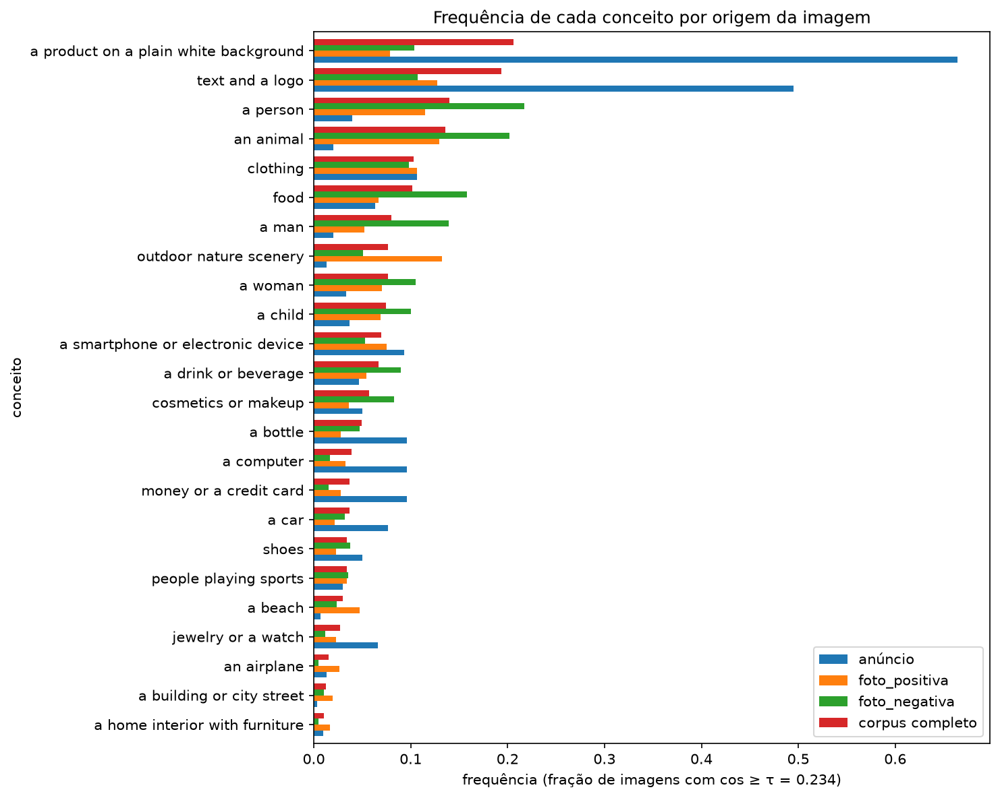

**A separação por origem é o que dá sentido ao ranking:**

- **anúncios:** produto em fundo branco (66%) e texto/logo (50%), depois garrafa, computador, dinheiro/cartão, carro e joias. **O anúncio mostra o produto e a marca**, e pessoas aparecem em menos de 5%.
- **fotos de que os participantes gostam:** natureza, animais de estimação, memes (texto) e praia.
- **fotos que os participantes rejeitam:** pessoas, animais (insetos, roedores), comida.

O vocabulário visual dos anúncios é quase o oposto do vocabulário que esses consumidores dizem preferir. Esse descompasso entre anúncio e preferência é justamente o que o ADS-16 foi criado para estudar.

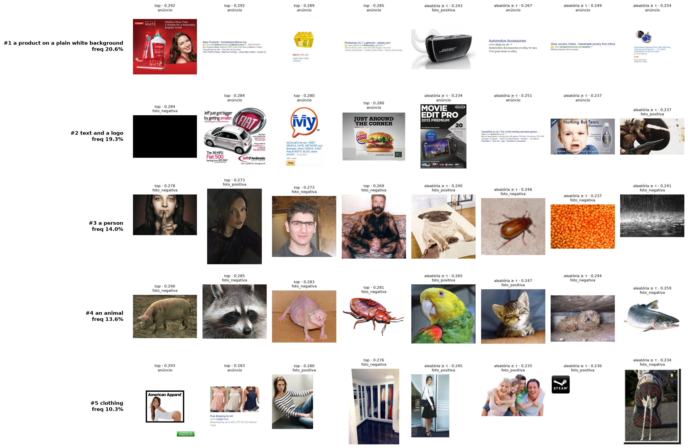

**Inspeção qualitativa do top-5:**

- **an animal:** precisão alta. Porco, guaxinim, percevejo, papagaio, gatinho e peixe estão todos corretos.
- **text and a logo:** boa (Fiat, Burger King, Movie Edit Pro). Há um erro revelador: uma **imagem toda preta** obteve 0,284.
- **clothing:** bom no topo. Entre as sorteadas há casos-limite.
- **product on plain white background:** mede o **layout**, não o produto. Anúncios **só de texto** (texto azul em fundo branco) também passam.
- **a person:** o topo é correto, mas as sorteadas acima de τ incluem pug, besouro, feijão e chuva. Conceitos **genéricos** têm similaridade-base maior com qualquer imagem, então um τ único favorece esses conceitos.

**Melhoria proposta:** usar um τ **por conceito**.

## 3.4 Resultados do item 2.2: busca semântica

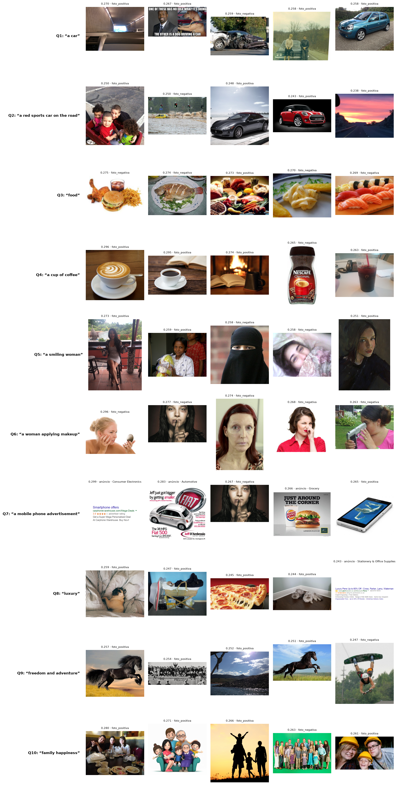

| # | Consulta | Tipo | P@5 | Interpretação |
|---|---|---|---|---|
| 1 | a car | concreto, genérico | 5/5 | Correto. Inclui um **meme** recuperado pela **legenda escrita** "...A DOG DRIVING A CAR" (*typographic bias*). |
| 2 | a red sports car on the road | concreto, específico | 1/5 | **Falha de composição.** Esportivo **cinza**, Mini **vermelho** em estúdio, carrinho **vermelho** de criança, estrada ao pôr do sol **avermelhado**. Cada atributo é satisfeito por uma imagem diferente (*attribute binding*). |
| 3 | food | concreto, genérico | 5/5 | Correto. 4/5 vêm das fotos **rejeitadas**: o CLIP recupera o conteúdo, não o sentimento. |
| 4 | a cup of coffee | concreto, específico | 4/5 | *Latte*, xícara, caneca com lareira, pote de Nescafé. Erro: copo de suco. |
| 5 | a smiling woman | atributo | 2/5 | Todas são mulheres, mas o **sorriso** é ignorado (niqab, retratos sérios). |
| 6 | a woman applying makeup | ação | 1/5 | A **ação** se perde e sobra "close de rosto feminino". |
| 7 | a mobile phone advertisement | gênero + produto | 2/5 | A consulta é decomposta em "anúncio" **ou** "celular": anúncios de Fiat e Burger King, e uma foto de celular que não é anúncio. |
| 8 | luxury | abstrato | 1/5 | Scores baixos. O único acerto é **lexical** (anúncio de texto "Luxury Pens"). |
| 9 | freedom and adventure | abstrato | 4/5 | Bons **proxies visuais**: cavalos galopando, montanhas, wakeboard. |
| 10 | family happiness | abstrato, social | 4/5 | Família à mesa, silhueta ao pôr do sol, família numerosa. |

**Padrões:**

1. **Genérico e concreto funciona** (5/5), mas **cada atributo composicional** (cor, expressão, ação) é tratado separadamente do objeto. É uma limitação de modelos contrastivos com embedding global.
2. O **abstrato funciona quando há clichê visual** ("liberdade" vira cavalo e montanha) e **falha quando não há** ("luxo"). Nesse caso, o modelo se apoia em **texto escrito na imagem**.
3. **Typographic bias** aparece em 3 das 10 consultas. Num corpus de publicidade, isso é útil e perigoso ao mesmo tempo.
4. **Viés de template:** com "a photo of…", as fotos naturais vencem os anúncios diagramados em 9 de 10 consultas. Para buscar anúncios, o prompt teria que mudar (o prompt "faz parte do modelo", Aula 06).
5. **Variação do threshold:**
   - Com τ = 0,22, "a mobile phone advertisement" aceita 292 imagens e "luxury" aceita 144, por associação fraca: pet na cama, logo da Chipotle.
   - Com τ = 0,28, só 6 imagens passam somando as 10 consultas.
   - **Para busca, o top-k ordenado é mais útil que um corte absoluto.** O τ serve de filtro mínimo de confiança.

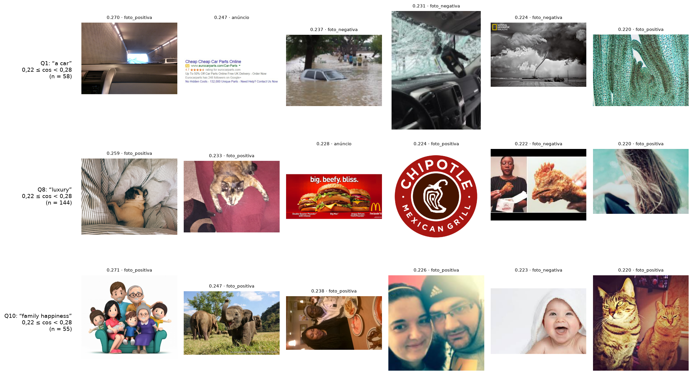

## 3.5 Por que o CLIP recupera imagens por texto sem treino supervisionado

**O mecanismo.** O CLIP tem duas torres, um encoder de imagem (ViT-B/32) e um encoder de texto (Transformer). Ambas projetam a entrada para o **mesmo espaço de 512 dimensões**, normalizado em L2. O pré-treino em 400 M pares imagem–legenda da web minimiza a **InfoNCE simétrica**:

`L = ½ [CE(imagem → texto) + CE(texto → imagem)]`, com `S_ij = cos(I_i, T_j)/τ`.

Isso **maximiza a similaridade dos pares corretos** (a diagonal da matriz N×N do *batch*) e **minimiza a dos N²−N pares errados**. Duas consequências tornam a busca possível sem treino:

1. **O texto vira o classificador.** Qualquer frase gera um vetor de consulta, e o vocabulário é aberto. Não há a camada `Linear(D, 1000)` de um modelo supervisionado, presa às classes do treino.
2. **A supervisão vem da linguagem natural**, muito mais rica que um rótulo único: objetos, cenas, ações, estilos e até texto escrito na imagem.

**Evidência medida no ADS-16.** Usamos os ~1.200 pares foto × legenda do participante (nada é ajustado neles):

| Busca legenda → foto (1.183 fotos) | R@1 | R@5 | R@10 | R@50 | Posição mediana da foto certa |
|---|---|---|---|---|---|
| **CLIP zero-shot** | **39,9%** | **64,3%** | **72,8%** | **86,1%** | **2ª** |
| Acaso | 0,08% | 0,42% | 0,85% | 4,23% | 592ª |

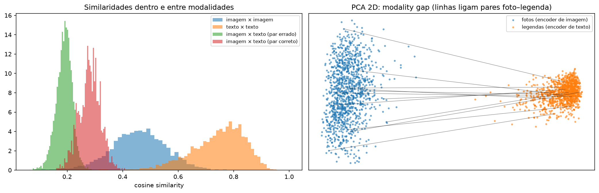

**Modality gap.** As medidas mostram que as duas modalidades ocupam regiões separadas da hiperesfera:

- cosseno médio imagem×imagem de 0,46 e texto×texto de 0,75;
- imagem×texto de **0,28 no par certo** e **0,19 no par errado**;
- centroides das modalidades a 0,91 de distância.

O objetivo contrastivo só exige a **ordenação** (o par certo mais perto que os errados), não a sobreposição. O sinal útil está na diferença 0,28 vs 0,19, e por isso o threshold teve de ser calibrado.

## 3.6 Consulta textual: CLIP × BERT (tokenização, padding e attention mask)

| | CLIP (encoder de texto) | BERT |
|---|---|---|
| Tokenização | BPE em bytes, 49.408 tokens | WordPiece, 30.522 tokens |
| "a car" | `[49406, 320, 1615, 49407, 0, 0, …]` (77 posições) | `[101, 1037, 2482, 102, 0, …]` |
| Tokens especiais | `<start_of_text>`, `<end_of_text>` | `[CLS]`, `[SEP]`, `[PAD]` |
| Comprimento | **fixo em 77**, com zeros de padding | variável, padding até o maior do *batch* ou `max_length` |
| Máscara | **causal** fixa (−∞ acima da diagonal) | **bidirecional** + `attention_mask` (1 = real, 0 = `[PAD]`) |
| Vetor da frase | estado do `<end_of_text>` → 512-d | estado do `[CLS]` (ou *pooling*) |

**Papel do padding e da attention mask.**

- **No BERT**, a atenção é bidirecional. Sem máscara, todo token (inclusive o `[CLS]`) atenderia aos `[PAD]`, e a representação mudaria conforme o tamanho do padding. A `attention_mask` soma −∞ aos scores das colunas de padding e zera o peso delas no softmax. É o mesmo mecanismo testado no módulo de atenção da A1 (teste 4).
- **No CLIP**, a máscara causal já impede que o `<end_of_text>` veja o que vem depois dele, e o padding vem justamente depois. **Teste:** trocando todo o conteúdo do padding, o embedding da consulta muda **0,00**.

**Consequências para a busca:**

- A consulta vira um vetor único de tamanho fixo, independente do *batch*.
- Consultas com mais de 77 tokens são truncadas.
- A fraca composição de atributos observada (por exemplo, "red sports car") vem principalmente do **objetivo contrastivo**, que raramente exige ligar o atributo ao objeto certo para separar a legenda correta das erradas. Esses modelos se comportam como "saco de palavras" (Yuksekgonul et al., 2023). A leitura causal resumida num único token não compensa isso como a atenção bidirecional do BERT.

## 3.7 Análise crítica

- **O que funcionou:**
  - zero-shot de 60% top-1 em 20 categorias, sem treino;
  - ranking interpretável e estável em torno do τ calibrado;
  - busca excelente para consultas concretas e genéricas.
- **Limitações:**
  - patches de 32 px perdem detalhes pequenos (logos, joias);
  - o embedding global não compõe atributos;
  - um τ único favorece conceitos genéricos;
  - a P@5 foi anotada por um único avaliador.
- **O que eu mudaria:**
  - testar o CLIP ViT-L/14;
  - calibrar τ por conceito;
  - usar prompts específicos por origem ("an advertisement for…" para anúncios);
  - usar o CLIP só como gerador de candidatos, com verificação por um detector de objetos quando a "presença" precisar ser auditável.

# 4. Atividade 3: classificador com CNN pré-treinada (feature extraction)

## 4.1 Definição do problema

Classificar as imagens do *Images Dataset* (Kaggle, `pavansanagapati/images-dataset`) em 7 categorias: `bike`, `cars`, `cats`, `dogs`, `flowers`, `horses` e `human`. O método é *transfer learning* por **feature extraction**: o backbone pré-treinado fica congelado e só uma nova camada de classificação é treinada, em um único treino.

**Inventário e limpeza.** A inspeção dos dados revelou três problemas antes de qualquer treino:

1. O zip contém uma **cópia integral do dataset em `data/data/`**. Usá-la duplicaria as 1.803 imagens e espalharia cópias entre treino e teste. Essa pasta foi ignorada.
2. Há **39 duplicatas exatas** (MD5), 19 em `horses`, 19 em `human` e 1 em `bike`. Foram removidas, e ficaram **1.764 imagens**.
3. **Cada classe vem de uma fonte com assinatura própria**:
   - `bike` e `cars`: BMP 640×480, fotos de rua;
   - `flowers`: PNG 128×128, cores posterizadas;
   - `human`: JPG em retrato (proporção 0,73), quase sempre cavaleiros em traje de equitação;
   - `cats` e `dogs`: JPG.

   Resolução, formato e paleta se correlacionam com a classe, e isso cria **atalhos de aquisição**. O efeito aparece no teste de estresse (seção 4.4).

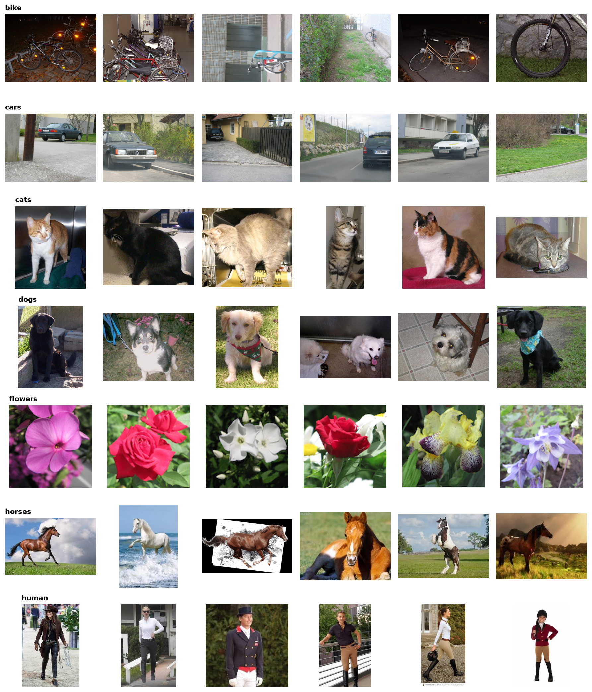

## 4.2 Decisões técnicas e justificativa

**Escolha do modelo pré-treinado, considerando o T4 e o número de classes:**

| Modelo | Parâmetros | GFLOPs | Top-1 ImageNet | Features | Observação |
|---|---|---|---|---|---|
| ResNet-18 | 11,7 M | 1,8 | 69,8% | 512 | features mais fracas |
| EfficientNet-B0 | 5,3 M | 0,4 | 77,7% | 1280 | a mais leve; boa para *edge* |
| **ResNet-50 (V2)** | **25,6 M** | **4,1** | **80,9%** | **2048** | **escolhida** |
| ViT-B/16 | 86,6 M | 17,6 | 81,1% | 768 | 4× mais cara, sem ganho de top-1 |

- **Capacidade do T4 (16 GB):** em feature extraction só há inferência no backbone. A VRAM medida durante a extração ficou bem abaixo de 1 GB. Mesmo um fine-tuning completo da ResNet-50 (~8,5 GB com batch 64, Aula 01) caberia no T4. Não há motivo de memória para um modelo menor.
- **Número de classes:** são só 7 classes. A cabeça `Linear(2048, 7)` tem 14.343 parâmetros para ~176 imagens de treino por classe. O gargalo de um classificador linear é a **separabilidade** das features, então vale usar o backbone com as features mais fortes dentro de um custo moderado.
- **Domínio:** as 7 categorias são objetos que o ImageNet cobre (raças de cães e gatos, *mountain bike*, *sports car*, *daisy*, *sorrel*). A ResNet-50 tem o mesmo top-1 do ViT-B/16 com ¼ do custo. A EfficientNet-B0 seria a escolha se a restrição fosse latência ou memória.

| Decisão | Escolha | Justificativa |
|---|---|---|
| Backbone | **ResNet-50**, `ResNet50_Weights.IMAGENET1K_V2` | Ver a tabela acima. É também a CNN de referência das Aulas 01/08. |
| Pré-processamento | `weights.transforms()`: resize 232, crop 224, normalização ImageNet | É a distribuição exata do pré-treino. Pré-processamento errado gera "bug silencioso" (Aula 01). |
| Congelamento | `requires_grad=False` em todo o backbone e backbone em `eval()` | Sem `eval()`, as estatísticas do BatchNorm seriam atualizadas, mesmo com os pesos congelados. |
| Nova cabeça | `nn.Linear(2048, 7)`: 14.343 parâmetros | Substitui a `fc` de 1000 classes. |
| Treino | Adam, lr = 1e-3, batch 32, 15 épocas, cross-entropy; checkpoint de menor loss de validação | Receita da Aula 01. A cabeça parte do zero e o problema é convexo nela. |
| Eficiência | Features extraídas **uma vez** e guardadas em cache (Aula 03) | Com backbone congelado e sem augmentation, a saída do backbone é determinística, e treinar sobre o cache é matematicamente idêntico. Verificado: a ResNet-50 completa, montada com a cabeça treinada, concorda em 100% com as predições feitas a partir do cache. |
| Divisão | Estratificada 70/15/15 (1.234 / 265 / 265) | Preserva a proporção das classes (`cars` tem 2,3× mais imagens que `horses`). |

## 4.3 Resultados (item 3.1)

Accuracy global (teste): <b>99,62%</b> Balanced accuracy: <b>99,74%</b> Erros no teste: <b>1 de 265</b>

| Classe | n teste | Acertos | Accuracy |
|---|---|---|---|
| bike | 54 | 53 | 98,15% |
| cars | 63 | 63 | 100% |
| cats | 30 | 30 | 100% |
| dogs | 31 | 31 | 100% |
| flowers | 32 | 32 | 100% |
| horses | 28 | 28 | 100% |
| human | 27 | 27 | 100% |

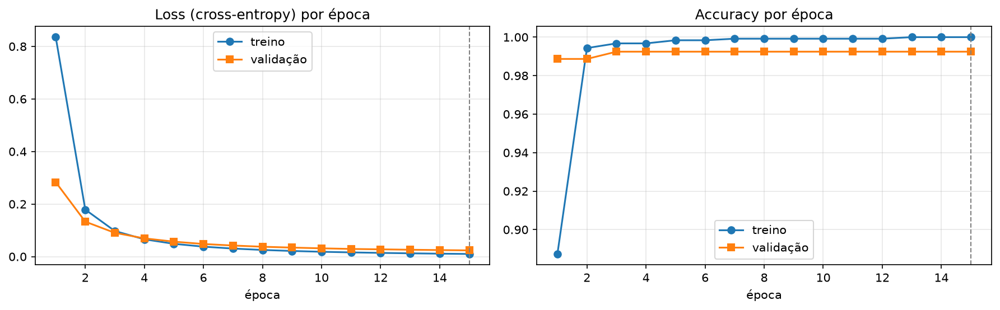

As curvas mostram convergência rápida, sem *overfitting*. A accuracy de validação chega a 99,2% na época 3 e se estabiliza. A loss de validação cai monotonamente até a época 15, que é a escolhida.

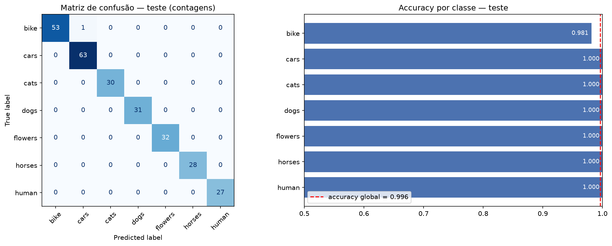

**O único erro de teste** é uma foto de rua rotulada `bike` em que a bicicleta ocupa uma pequena área à esquerda, numa cena dominada por contêineres de lixo e asfalto. O modelo prevê `cars` com confiança de apenas 0,48. Em treino, validação e teste somados há só 3 erros: `bike→cars`, `cars→bike` e `cats→dogs`. As classes `bike` e `cars` são **fotos de cena** com contexto urbano compartilhado, enquanto as outras cinco são **centradas no objeto**. A confusão vem do contexto.

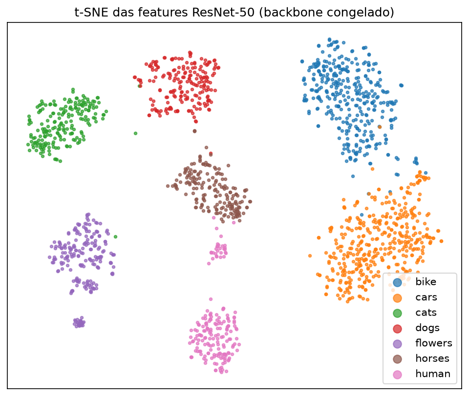

## 4.4 Análise crítica e propostas de melhoria (item 3.2)

**O teste está saturado.** Com 1 erro em 265, cada imagem vale 0,4 ponto percentual, e nenhuma melhoria de augmentation seria mensurável neste conjunto de teste. O t-SNE explica por quê: as features genéricas do ImageNet já separam as 7 classes quase perfeitamente. O valor de qualquer augmentation está na **robustez a mudança de distribuição** (outras câmeras, resoluções e enquadramentos). Para embasar a discussão com dados e não só com intuição, sem fazer um segundo treino, rodamos dois experimentos:

- um **teste de estresse** (Aula 08): o modelo treinado foi avaliado nas 530 imagens de validação e teste, transformadas;
- uma **sondagem da normalização** com classificador por centroide.

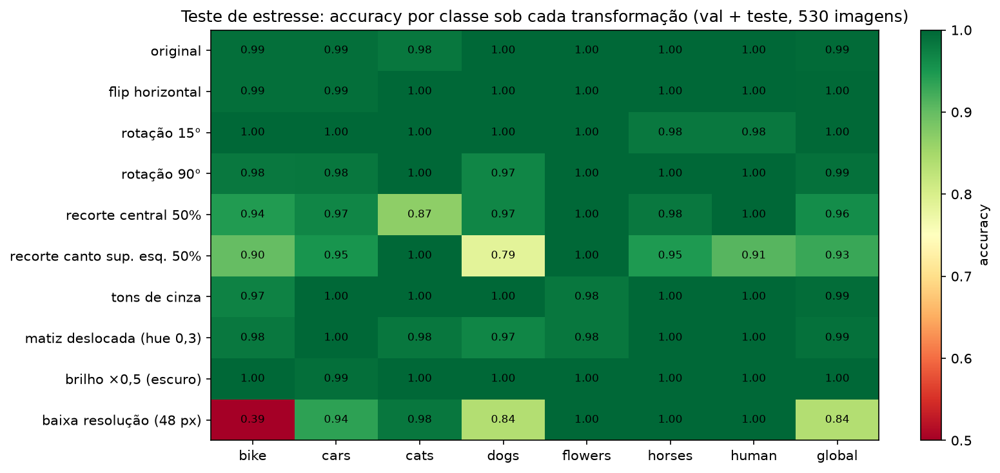

**1. Augmentation geométrica.**
- *Flip horizontal:* **benéfico e seguro para todas as classes**, porque nenhuma tem semântica esquerda/direita. O modelo já é invariante (99,6% com flip), então o ganho é pequeno e o risco é nulo.
- *Rotação leve (±10–15°):* **benéfica**. Algumas fotos de `bike` foram tiradas com a câmera girada. A queda sob 15° é mínima (98,2% em `horses` e `human`). **Rotações grandes são irreais** para animais e pessoas, que estão sempre em pé: sob 90°, `dogs` cai para 96,7%. Não as usaria.
- *Recorte aleatório:* **benéfico com escala moderada, prejudicial se agressivo**. Um recorte de 50% no canto derruba `dogs` para 78,7%, `bike` para 89,9% e `human` para 90,9%. Um recorte central derruba `cats` para 86,9%. Em `bike` e `cars` o objeto é pequeno e fora do centro, então um recorte pode excluí-lo e gerar **ruído de rótulo**. Em `human` (retrato) o recorte corta cabeça ou pés. Em `cats`/`dogs`, perder o focinho apaga o traço que mais diferencia as duas classes. Usaria `RandomResizedCrop(scale=(0.6, 1))`, nunca o padrão (0,08).

**2. Augmentation de cor.**
- *Brilho e contraste:* **benéficos** como robustez. `bike` tem fotos noturnas, e escurecer pela metade mantém 99,8%.
- *Matiz e grayscale:* **dependem da classe**. `flowers` tem a maior saturação média (0,42, contra 0,15–0,36 nas demais), e a cor é parte legítima da classe: grayscale e matiz deslocada introduzem erros em `flowers`, além de quedas em `bike` e `dogs`. Jitter de matiz forte ou grayscale com p alto **prejudicaria `flowers`**. Por outro lado, a paleta posterizada de `flowers`, `horses` e `human` é um artefato de aquisição. Um jitter leve com grayscale a p ≈ 0,1 (como na Aula 08) reduz a dependência desse atalho sem apagar a cor. Para `cats`, `dogs` e `horses` a cor da pelagem não é discriminativa, e o jitter é seguro.

**3. Variação de escala.** **É a melhoria mais importante para este dataset.**
- Com as imagens reduzidas a 48 px e reampliadas, `bike` despenca para **38,5%**, `dogs` vai a 83,6% e `cars` a 93,7%, enquanto `flowers`, `horses` e `human` ficam em 100%.
- Bicicletas são estruturas finas que somem em baixa resolução.
- As três classes imunes são exatamente as de **origem em baixa resolução**: `flowers` (128×128), `human` (~188×257) e `horses` (~259×194).
- As bicicletas reduzidas a 48 px vão, em sua maioria, para **`human`** (27 casos), a classe de menor resolução nativa, e depois para `cats` (18) e `cars` (15).
- Para o modelo, "imagem de baixa resolução" é em parte uma pista de classe: é o atalho de aquisição descrito na seção 4.1.
- Treinar com **multi-escala** (`RandomResizedCrop` + redução e ampliação aleatórias) desacopla resolução de classe.
- Riscos: limitar a redução mínima em `bike`/`cars`, para o objeto não ficar irreconhecível, e usar *letterbox* em `human` para não cortar o corpo.

**4. Normalização ImageNet.** Já é usada no item 3.1 e é **obrigatória por construção**. Com o backbone congelado, filtros e estatísticas de BatchNorm foram calibrados para entradas com essa média e desvio, e nenhum parâmetro pode se adaptar a outra distribuição. **O experimento, porém, mostrou honestamente que neste dataset o efeito é pequeno:**
- as features com e sem normalização têm cosseno médio de 0,92;
- o classificador por centroide dá 98,9% nos dois casos;
- a cabeça treinada mantém 99,6% recebendo features sem normalização.

As classes estão tão separadas que um deslocamento de 8% no espaço de features não muda decisões. Isso **não** generaliza para classes finas ou domínios distantes do ImageNet, onde as fronteiras são apertadas. Por isso a normalização é tratada como requisito de correção, e não como hiperparâmetro.

**Feature extraction ou fine-tuning: quando usar cada um.** A decisão depende do **volume de dados rotulados** e da **distância entre o domínio e o pré-treino** (Aulas 01, 03, 06 e 08):

| | Domínio próximo do ImageNet | Domínio distante (raio-X, metal, satélite) |
|---|---|---|
| **Poucos dados** | **Feature extraction** (este caso): sem *overfitting* nem esquecimento, roda em segundos | **Fine-tuning parcial** (últimos blocos, LR 1e-5 / 1e-3) + augmentation forte, com o *linear probe* como baseline |
| **Muitos dados** | Fine-tuning das camadas finais ou completo, com ganho modesto | **Fine-tuning completo** |

Aqui são 1.234 imagens de treino de categorias que o ImageNet cobre, e o feature extraction já chega a 99,6%. Um fine-tuning atualizaria 23,5 M parâmetros com ~1.200 imagens, com custo maior, risco de sobreajuste e perda de robustez (Aula 06), e sem margem mensurável no teste. Os outros projetos deste trabalho mostram o outro lado da tabela:

- **A1 (metal fundido, domínio distante):** o *linear probe* chega a 0,987 de balanced accuracy, e o fine-tuning chega a 1,000.
- **A4.1 (raio-X):** o fine-tuning de uma ResNet-18 pré-treinada levou o recall de COVID-19 de 41,7% para 82–93%.

**Regra prática:** começar sempre por feature extraction ou *linear probe*. Partir para fine-tuning (primeiro parcial, depois completo) só se a validação mostrar que as features congeladas não bastam.

**Ordem em que eu testaria:**
1. **Criar um teste com mudança de distribuição**, porque o atual está saturado.
2. Multi-escala, voltada ao colapso de `bike` e ao atalho de resolução.
3. Flip e rotação ±10°.
4. Brilho e contraste moderados, com grayscale a p = 0,1 e sem matiz forte.

Com augmentation, o cache de features deixa de valer e o backbone congelado volta a rodar a cada época. Se a robustez ainda for insuficiente, o passo seguinte é o fine-tuning parcial da `layer4` com LR diferencial (1e-5 / 1e-3, Aula 08).

# 5. Atividade 4.1: estudo de caso de COVID-19 em radiografias de tórax

## 5.1 Definição do problema

Um grupo entregou um sistema de triagem Normal / Pneumonia / COVID-19 com resultados "promissores", mas o time clínico relatou que o modelo **"ignora casos positivos"**. A configuração era:

- 1.200 radiografias: Normal 840, Pneumonia 240, COVID-19 120;
- divisão 80/20 sem estratificação;
- ResNet-18 **sem pré-treino**, SGD com LR fixo de 0,01, 15 épocas, sem augmentation;
- avaliação **só por accuracy global**;
- resultado: 93% no treino e 61% na validação.

A tarefa tem quatro partes: diagnosticar ao menos cinco problemas, implementar uma abordagem generativa para a escassez de COVID-19, medir o impacto no recall dessa classe e propor um plano integrado.

**Dados.** Usamos a *COVID-19 Radiography Database* (Kaggle) e sorteamos com semente fixa **exatamente o cenário do enunciado**: Normal 840, Pneumonia viral 240 e COVID-19 120. Também separamos um **teste ampliado** com 1.500 radiografias reais fora dessas 1.200 (600 Normal, 300 Pneumonia, 600 COVID-19). Com só 18 COVID-19 no teste do cenário, cada caso vale 5,6 p.p. de recall, e o teste ampliado dá estimativas estáveis. As imagens são convertidas para tons de cinza em 128×128, a resolução que a GAN gera, para que reais e sintéticas passem pelo mesmo pipeline.

> **Nota bibliográfica.** O enunciado atribui o artigo de referência a "Nour & Tariq (2023)". O DOI indicado (10.1038/s41598-023-37743-4) corresponde, segundo o Crossref e o Europe PMC, a *Dumakude & Ezugwu, "Automated COVID-19 detection with convolutional neural networks", Scientific Reports 13, 10607 (2023)*. Citamos o artigo pelo DOI fornecido. A afirmação de que o recall da classe COVID-19 fica abaixo de 60% em dados desbalanceados é atribuída ao enunciado.

**Um risco de *shortcut* que já está nos dados.** Os metadados mostram que **cada classe vem de repositórios diferentes**:

| Fonte | Normal | Pneumonia | COVID-19 |
|---|---|---|---|
| kaggle.com/c (RSNA) | 732 | 0 | 0 |
| kaggle.com/paultimothymooney | 108 | 240 | 0 |
| bimcv.cipf.es | 0 | 0 | 72 |
| github (armiro, ieee8023, ml-workgroup) | 0 | 0 | 32 |
| eurorad.org / sirm.org | 0 | 0 | 16 |

Um modelo pode aprender a reconhecer **a fonte** (equipamento, marcações, contraste) em vez da doença.

## 5.2 Diagnóstico: problemas técnicos e impacto clínico

| # | Problema | Evidência | Impacto clínico esperado | Correção |
|---|---|---|---|---|
| 1 | ResNet-18 **sem pré-treino** | 11,7 M parâmetros aprendidos do zero com ~960 imagens | Não aprende features gerais, decora o treino e faz diagnósticos instáveis | *Transfer learning* do ImageNet (Aula 01) |
| 2 | **Overfitting** | 93% vs 61%: gap de 32 p.p. | O "promissor" é ilusório; em produção fica perto dos 61% | Pré-treino, augmentation, regularização, *early stopping* |
| 3 | **Sem augmentation** | Cada imagem é vista sempre igual | Frágil a posicionamento, exposição e outro equipamento | Augmentation **clinicamente válida**, **sem flip horizontal** (coração à esquerda, Aula 08) |
| 4 | **Desbalanceamento não tratado** (7:1) | A *loss* é dominada por Normal | **Falsos negativos de COVID-19**: pacientes infectados liberados sem isolamento | Sintéticas, pesos por classe, *oversampling*, limiar calibrado |
| 5 | **Split sem estratificação** | A validação recebe por sorteio de ~15 a ~30 COVID-19 | A métrica de COVID-19 vira loteria | `stratify=y` (Aula 08) e várias sementes |
| 6 | **Accuracy como única métrica** | "61%" sem recall por classe | **Paradoxo da acurácia**: o "ignora positivos" fica invisível | Recall/sensibilidade por classe como métrica primária, especificidade, F1, balanced accuracy |
| 7 | **SGD com LR fixo e 15 épocas arbitrárias** | Sem *scheduler* nem critério de parada | O modelo final é o da época 15, não o melhor; não reprodutível | *Scheduler* + seleção pela validação |
| 8 | **Sem teste independente** | A validação ajusta **e** reporta | Número reportado otimista | Treino/validação/teste com o teste usado uma vez |
| 9 | **Vazamento por paciente e viés de fonte** | Classes vêm de repositórios distintos; não há ID de paciente | O modelo pode aprender o hospital, não a doença, e falhar em silêncio em outro hospital | `GroupKFold` por paciente, validação multicêntrica, auditoria com mapas de atenção |
| 10 | **Limiar não calibrado** | `argmax` padrão | Trata FN e FP como igualmente graves, o que em triagem é inadequado | Limiar escolhido para uma sensibilidade-alvo |

### Reprodução do baseline: a queixa clínica confirmada

Reproduzimos a configuração original: `resnet18(weights=None)`, SGD com 0,01, 15 épocas, sem augmentation e 80/20 sem estratificação.

Accuracy treino <b>99,8%</b> Accuracy validação <b>89,6%</b> Recall COVID-19 <b>41,7%</b>

A accuracy de validação "promissora" esconde que **14 de cada 24 pacientes com COVID-19 seriam liberados como "Normal"**. Normal tem recall de 99,4% e Pneumonia de 78,3%. É exatamente o comportamento descrito pelo time clínico.

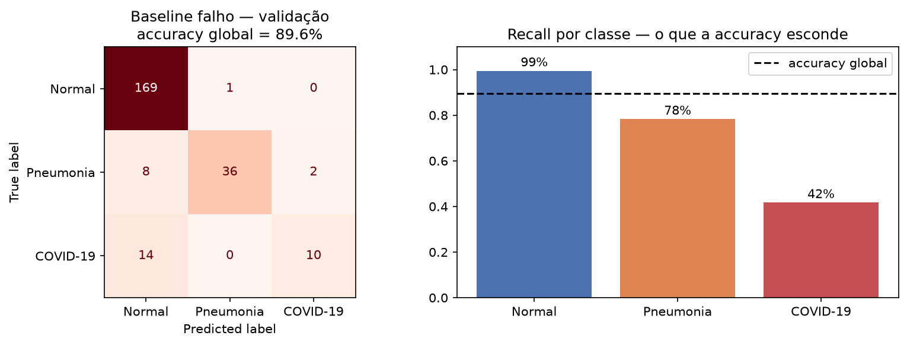

## 5.3 Abordagem generativa: GAN condicional (DCGAN), 128×128

**Escolha: cGAN, e não CycleGAN.** Há só **84 COVID-19 no treino**. Uma GAN condicional (Mirza & Osindero, 2014; Aula 07) treina com as **840** imagens das três classes: a anatomia comum é aprendida com todas, e o rótulo direciona a geração. A CycleGAN (Normal→COVID-19) seria a alternativa. Ela tem dois geradores e dois discriminadores e é mais pesada para o T4, e fica no plano de melhoria.

**Arquitetura (Aula 07):**

- **G(z, y):** z ∈ ℝ¹⁰⁰ concatenado ao *embedding* de classe (16-d), seguido de `ConvTranspose2d` + BatchNorm + ReLU de 4×4 até 128×128 e saída `Tanh` (3,75 M parâmetros).
- **D(x, y):** a imagem recebe um mapa espacial aprendido da classe como 2º canal, seguido de `Conv2d` stride 2 + LeakyReLU(0,2) com **Spectral Normalization** (2,84 M parâmetros).

**Estabilização (Aula 07):**

- perda **não-saturante**;
- **TTUR** (η_D = 4e-4, η_G = 1e-4, Adam β = (0,5; 0,999));
- *label smoothing* **unilateral** (reais = 0,9);
- ***instance noise*** com *annealing*;
- **amostragem balanceada por classe**, para que COVID-19 não apareça em só 10% dos *batches*.

O treino teve 6.000 iterações com batch 64, **só com o conjunto de treino**.

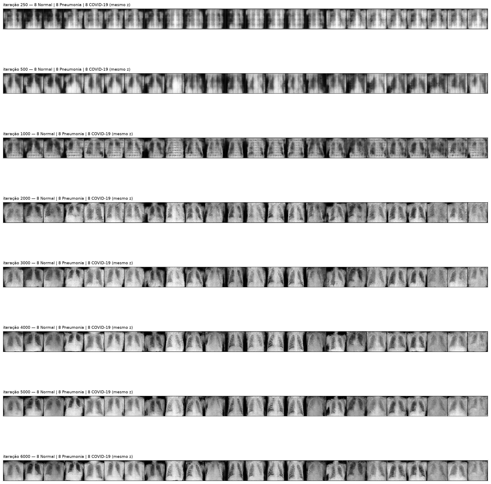

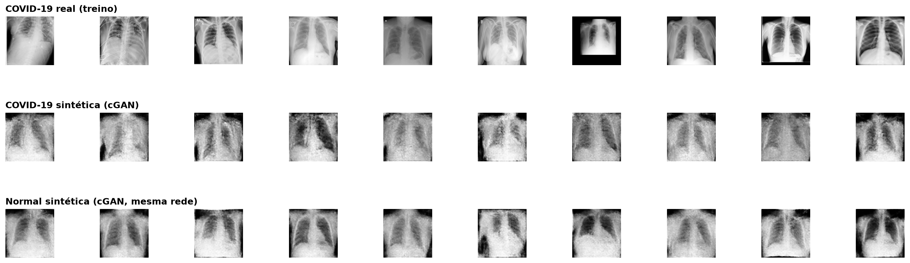

**Qualidade das sintéticas (Aula 08):**

| Comparação | N₁ | N₂ | FID | KID ×10³ |
|---|---|---|---|---|
| sintéticas COVID-19 × reais COVID-19 (treino) | 504 | 84 | **385,8** | **463,7** |
| reais COVID-19 (teste ampliado) × reais COVID-19 (treino) | 600 | 84 | 82,9 | −1,6 (≈ 0) |
| reais Normal × reais COVID-19 (treino) | 588 | 84 | 108,1 | 26,1 |

O FID com N = 84 é inflado: o FID real×real de 82,9 vem só do N pequeno, e o KID não enviesado dá ≈ 0. Mesmo assim, **as sintéticas estão mais longe das COVID-19 reais do que as radiografias Normais estão**. A anatomia é plausível, mas há uma **textura granulada** que não existe nas reais. Outros dois indicadores:

- **Diversidade:** o MSE médio entre pares é 0,043 nas sintéticas e 0,074 nas reais. É *mode collapse* parcial: 42% menos variedade.
- **Memorização:** as sintéticas **não** copiam o treino; as vizinhas mais próximas são visivelmente outras imagens.

### Instabilidades de treino: diagnóstico e mitigação com evidência

Para testar se as receitas de estabilização fazem diferença, treinamos do zero **três variantes** com o mesmo gerador, os mesmos dados, a mesma semente e 2.500 iterações cada:

1. **DCGAN de livro:** BatchNorm no D, LR igual de 2e-4, rótulo 1,0, sem ruído.
2. **cGAN estabilizada:** SN, TTUR, *label smoothing* e *instance noise*.
3. **Estabilizada + minibatch-std** (Karras et al., 2018): o D recebe um canal com o desvio-padrão das features **ao longo do batch**, o que permite "ver" e penalizar amostras parecidas entre si.

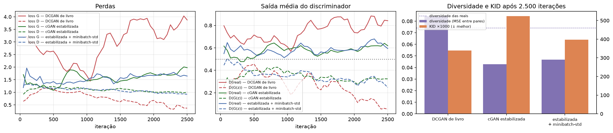

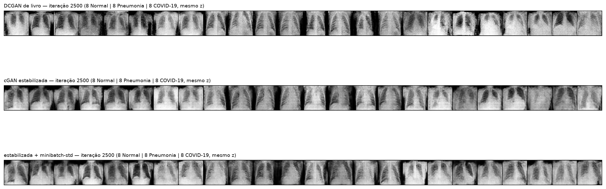

| Variante (2.500 it.) | Diversidade (reais = 0,074) | KID ×10³ ↓ | FID ↓ | D(real) / D(G(z)) finais | loss_G final |
|---|---|---|---|---|---|
| DCGAN de livro | 0,084* | 339 | 316 | 0,86 / 0,10 | 3,78 (subindo) |
| cGAN estabilizada | 0,043 | 523 | 427 | 0,62 / 0,33 | 1,83 (estável) |
| **estabilizada + minibatch-std** | **0,047** | **397** | **353** | 0,63 / 0,30 | 1,69 (estável) |

\* A diversidade em pixels da DCGAN de livro é inflada pelo **ruído granular** visível nas amostras.

**Diagnóstico 1: divergência na DCGAN de livro.** O discriminador **domina**:

- `loss_D` cai continuamente até 0,14;
- D(real) sobe a ~0,86 e D(G(z)) cai a ~0,05–0,10;
- `loss_G` sobe a ~4 e oscila.

O gerador passa a receber gradiente ruidoso e o jogo se afasta do equilíbrio (D ≈ 0,5).

**Mitigação 1 (SN + TTUR + smoothing + ruído).** O jogo fica **equilibrado e estável**: `loss_D` em ~1,0–1,1, perto do −log 4 do equilíbrio, D(real) ≈ 0,6 e D(G(z)) ≈ 0,3, sem tendência. Essa é a evidência de melhoria na dinâmica de treino. O custo é aprender mais devagar (η_G = 1e-4), com KID pior na mesma iteração. Surge também um ***mode collapse* parcial**: a diversidade cai para 58% da das reais, e as amostras ficam "médias".

**Diagnóstico 2 e mitigação 2.** Adicionar **minibatch-std** ao D estabilizado eleva a diversidade em **10%**, reduz o **KID em 24%** e o **FID em 17%**, e mantém o equilíbrio. A mitigação ataca exatamente o problema diagnosticado.

**Ressalvas.** Em 2.500 iterações, a versão de livro ainda tem o melhor KID: a divergência aparece nas curvas, mas ainda não degradou as amostras. O gerador usado no experimento de recall (6.000 iterações) não tem minibatch-std. Retreiná-lo com essa camada e medir o ΔRecall é o próximo passo.

## 5.4 Experimento: recall de COVID-19 com e sem imagens sintéticas

O split é **estratificado** 70/15/15 (COVID-19: 84 / 18 / 18). O classificador corrigido é idêntico em todas as condições:

- ResNet-18 **pré-treinada no ImageNet**;
- augmentation sem flip (rotação de ±10°, recorte leve, brilho/contraste);
- AdamW com LR diferencial e *one-cycle*, 12 épocas;
- seleção pelo macro-F1 de validação;
- **3 sementes por condição**.

**Sintéticas só no treino; validação e testes 100% reais** (Aula 08).

| Condição | Recall COVID (teste, n=18) | Recall COVID (ampliado, n=600) | ΔRecall (ampliado) | IC 95% bootstrap | Macro-F1 (ampliado) |
|---|---|---|---|---|---|
| **A**: só reais | 0,926 ± 0,032 | **0,826 ± 0,008** | — | — | 0,917 |
| **B1**: + 252 sintéticas | 0,852 ± 0,140 | 0,740 ± 0,096 | **−0,086** | [−0,110; −0,057] | 0,888 |
| **B2**: + 504 sintéticas (balanceado) | 0,963 ± 0,032 | 0,798 ± 0,063 | −0,028 | [−0,033; +0,017] | 0,903 |
| **C**: *class weights* (sem GAN) | 0,833 ± 0,056 | 0,797 ± 0,026 | −0,029 | [−0,060; −0,023] | 0,911 |

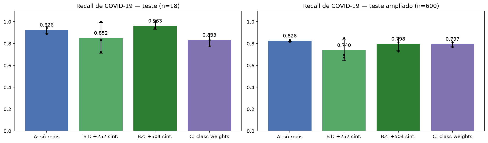

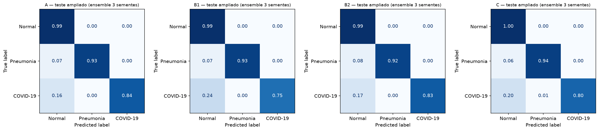

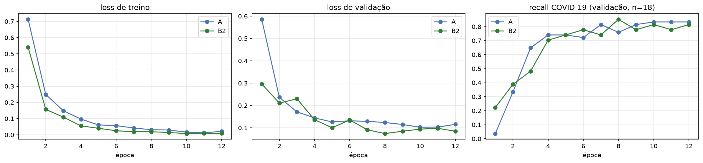

## 5.5 Análise crítica

1. **Corrigir o pipeline resolveu a maior parte do problema.** O recall de COVID-19 foi de **41,7%** no baseline para **92,6%** no teste do cenário e **82,6%** no teste ampliado, com precisão e especificidade de ~0,99, só corrigindo os problemas 1 a 8: pré-treino, augmentation válida, estratificação, otimização e métrica. A diferença entre os dois testes (92,6% vs 82,6%) mostra como um teste com 18 casos é otimista.

2. **As imagens da cGAN não melhoraram o recall, e na dose menor o pioraram.**
   - B2 parece ganhar 3,7 p.p. no teste pequeno, menos de uma imagem em média. No teste ampliado o efeito é −2,8 p.p., com IC contendo zero.
   - B1 piora significativamente (−8,6 p.p.).
   - As sintéticas também **aumentam muito a variância** entre sementes (±9,6 p.p. contra ±0,8 p.p.).

3. **O mecanismo é coerente com as métricas generativas.** Só a classe COVID-19 recebe sintéticas, e elas têm uma textura que nenhuma imagem real tem (FID 386). O classificador aprende **"textura de GAN ⇒ COVID-19"**, um atalho ausente no teste real. O conceito de COVID-19 do modelo se desloca para o domínio sintético: a **precisão sobe** (0,987 → 0,994) e o **recall cai**. É o alerta da Aula 07: realismo estatístico insuficiente não ajuda, e **a validação pelo recall *downstream* é obrigatória**. Sem ela, teríamos relatado o ganho aparente de B2 no teste pequeno.

4. **Os erros residuais são os perigosos.** Em todas as condições, COVID-19 errado vira **"Normal"** (16% em A), nunca Pneumonia. Esse é o caso que o limiar calibrado (problema 10) deve atacar.

5. **Limitações:**
   - viés de fonte não removível nesta base, então o desempenho em outro hospital é desconhecido;
   - sem ID de paciente;
   - uma única configuração de GAN;
   - 3 sementes.

## 5.6 Plano de melhoria integrado

| Fase | Ação | Problemas |
|---|---|---|
| **1. Dados e protocolo** | Base com ID de paciente, hospital e equipamento. COVID-19 e controles **das mesmas instituições**. RT-PCR como padrão-ouro. | 4, 9 |
| | `StratifiedGroupKFold` (classe × paciente) e **teste externo multicêntrico** usado uma vez | 5, 8, 9 |
| | **Sensibilidade de COVID-19 como métrica primária**, especificidade, F1, balanced accuracy, IC. **Limiar calibrado** para uma sensibilidade-alvo combinada com o time clínico (ex.: ≥ 95%). | 6, 10 |
| **2. Modelo** | *Transfer learning* (ImageNet ou backbones de radiografia de tórax) com LR diferencial | 1, 2 |
| | Augmentation clinicamente válida (rotação/translação/recorte leves, brilho/gama), **sem flip** | 3 |
| | AdamW + *cosine*/*one-cycle*, *early stopping* pela métrica clínica, várias sementes | 7 |
| **3. Escassez de COVID-19** | Primeiro o barato e comprovado: pré-treino + augmentation, depois pesos/*oversampling*, sempre por ΔRecall | 4 |
| | GAN **só com critério de aceite**: StyleGAN2-ADA/DiffAugment ou **CycleGAN Normal→COVID-19** (preserva a textura real; λ_cyc = 10, λ_idt = 5); resolução ≥ 256; FID/KID próximos de real×real; revisão por radiologista; filtro por confiança de um classificador treinado só com reais; usar ΔRecall com IC como critério de adoção | 4 |
| **4. Confiabilidade** | Auditoria de atalhos (Grad-CAM/atenção nos FN e FP; mascarar bordas e marcações) | 9 |
| | Implantação como **triagem assistida**: revisão humana dos negativos de baixa confiança, monitoramento de *drift* por hospital e retreino periódico | 2, 9 |

### Critério de adoção clínica (go/no-go)

O modelo só entra em uso assistido se cumprir **todos** os critérios abaixo no **teste externo multicêntrico**. Os limites são definidos com o time clínico **antes** de ver os resultados:

| Critério | Limite proposto | Por quê |
|---|---|---|
| Sensibilidade de COVID-19 no limiar operacional | ≥ 95%, com **limite inferior do IC 95% ≥ 90%** | O falso negativo libera um paciente infectado. O IC impede aprovar por sorte num teste pequeno, como o de 18 casos deste projeto. |
| Especificidade de COVID-19 | ≥ 85% | Mantém os falsos alarmes num volume que o serviço comporta. |
| Desempenho por subgrupo (hospital, equipamento, idade, sexo) | nenhum subgrupo com sensibilidade < 90% | Evita um modelo que funciona "na média" mas falha num hospital, que é o risco do viés de fonte. |
| Calibração | ECE ≤ 0,05 | A probabilidade precisa ser confiável para o limiar e para a revisão humana. |
| Não inferioridade | sensibilidade ≥ à do fluxo atual no mesmo conjunto | O sistema precisa agregar valor ao processo atual. |
| Auditoria de atalhos | atenção/Grad-CAM nos FN e FP sem foco em marcações, bordas ou texto | A decisão precisa vir do pulmão, não da fonte da imagem. |
| Dados sintéticos | só com **ΔRecall > 0 e IC excluindo zero** no teste real | Neste projeto, as sintéticas da cGAN **reprovam** nesse critério. |
| Fase silenciosa | 4–8 semanas em paralelo, sem afetar condutas | Confirma o desempenho com dados de produção. |

Se qualquer critério falhar, o projeto volta para as fases 1 e 2. Depois da adoção, os mesmos limites servem de gatilho para retreino ou desligamento.

# 6. Atividade 4.2: transfer learning para análise de tráfego urbano

## 6.1 Definição do problema

Um grupo classificou o fluxo de tráfego de câmeras urbanas em **livre**, **moderado** ou **congestionado**. O modelo foi uma ResNet-50 pré-treinada no ImageNet, com *fine-tuning* em **800 frames rotulados de 12 câmeras**. A accuracy de validação foi de 78% e o sistema foi implantado. Em produção, surgiram **falhas sistemáticas** em três situações: chuva, períodos noturnos e câmeras com ângulos que não estavam no treino.

O raciocínio "o ImageNet reconhece objetos, veículos são objetos, logo o transfer learning resolve" esconde duas suposições falsas. A primeira é que **a distribuição de produção é a mesma do treino**. A segunda é que **a tarefa é de reconhecimento de objetos**. A referência indicada (Meegle, *Transfer Learning for Traffic Analysis*) lista como armadilhas típicas:

- o descasamento entre domínio de origem e de destino (*data mismatch*);
- o *overfitting* no fine-tuning agressivo;
- o custo computacional;
- a baixa interpretabilidade.

Como soluções, aponta:

- alinhamento de domínio;
- regularização;
- modelos híbridos (aprendizado + métodos tradicionais);
- explicabilidade.

A análise a seguir detalha esses pontos para o caso concreto.

**Riscos específicos do transfer learning do ImageNet para classificar fluxo.**

1. **Viés de objeto, não de cena.** O ImageNet treina a rede para responder "qual é o objeto dominante?" (1 rótulo por imagem, objeto centralizado). "Congestionado" é uma propriedade **coletiva e espacial**: muitos veículos pequenos, ocupação da via, filas. As features finais da ResNet-50 são invariantes justamente ao que importa aqui (contagem, densidade, posição), porque o *global average pooling* descarta a localização.
2. **Viés de distribuição visual.** O ImageNet é dominado por fotos diurnas, nítidas, de câmeras amadoras, ao nível do chão. Câmeras de tráfego são altas, com perspectiva forte, baixa resolução, compressão de vídeo, noite com faróis e lentes molhadas. A suposição de que "as features genéricas servem" falha exatamente nas condições adversas.
3. **Ausência de tempo.** O pré-treino é sobre imagens estáticas. Fluxo depende de **velocidade**, e nada no ImageNet ensina dinâmica.
4. **Falsa sensação de suficiência.** Como o *fine-tuning* converge rápido e a accuracy de validação sai alta (78%), o pré-treino mascara a falta de dados e de diversidade. O modelo aprende atalhos das 12 cenas (o poste, a placa, o recorte do céu) que o pré-treino não impede.
5. **Esquecimento catastrófico.** O *fine-tuning* completo com 800 frames pode apagar parte das representações gerais, inclusive a robustez a iluminação que o modelo tinha (Aula 06).

## 6.2 Problemas identificados, impacto operacional e abordagem

### Problema 1: *covariate shift* de condição (chuva, noite, ofuscamento)

**O que acontece.** O conjunto de 800 frames quase certamente reflete as condições mais comuns na coleta: dia e tempo seco. À noite, a cena muda por completo. Os veículos viram pares de faróis e lanternas, o contraste cai e o ruído do sensor sobe. Na chuva, aparecem reflexos no asfalto, gotas na lente, desfoque e névoa. O modelo nunca viu essas distribuições, e o ImageNet também é majoritariamente diurno. É o *covariate shift* da Aula 08: P(x) muda e P(y|x) continua a mesma.

**Impacto operacional.** As falhas se concentram **justamente** quando o tráfego é mais crítico: chuva aumenta congestionamento e acidentes, e o fim de tarde no inverno já é noturno. Um "livre" falso num corredor congestionado na chuva leva a decisões erradas de semaforização, desvio e despacho de agentes. Como o erro é sistemático e não aleatório, os operadores perdem a confiança no sistema como um todo.

**Abordagem.**
1. **Medir antes de corrigir.** Registrar a condição de cada frame (dia/noite, seco/chuva/névoa, a partir do horário e de uma estação meteorológica). Montar **conjuntos de teste por condição** e reportar as métricas separadamente: é o teste de estresse OOD da Aula 08. A accuracy agregada de 78% esconde essa estrutura.
2. **Coleta direcionada** de frames noturnos e chuvosos, até cada condição ter representação mínima no treino.
3. **Augmentation fotométrica** coerente com a física da cena: brilho, gama, contraste, ruído de sensor, desfoque de movimento, *glare* e gotas sintéticas.
4. **Tradução de domínio com CycleGAN** (Aula 07): dia→noite e seco→chuva, treinada sem pares. Cada frame diurno rotulado ganha versões noturna e chuvosa **com o mesmo rótulo**, porque a densidade de veículos não muda com a tradução. A validação desse ganho segue a regra da Aula 08: imagens sintéticas só no treino e teste 100% real, medindo o ganho por condição.
5. **Alinhamento de domínio**, como sugere a referência. Por exemplo, ajuste das estatísticas de BatchNorm por condição, ou adaptação não supervisionada com frames não rotulados de produção, que existem em abundância.

### Problema 2: vazamento no protocolo de validação; os 78% são otimistas

**O que acontece.** Com 800 frames de 12 câmeras, cada câmera contribui com ~67 frames, muitos deles **consecutivos ou quase idênticos** (mesmo fundo, mesma posição dos postes, fluxo parecido). Uma divisão aleatória põe frames quase iguais da mesma câmera no treino e na validação. Assim, a validação mede **memorização do cenário** e não generalização. Ela também não mede o que importa em produção: o desempenho numa câmera nova ou num dia novo.

**Impacto operacional.** A decisão de implantar foi tomada com base num número que não representa o uso real. O sistema entrou em produção sem ninguém saber que ele generaliza mal para outras câmeras, e o problema só apareceu em campo, com custo e desgaste institucional.

**Abordagem.**
- **Divisão por grupo:** `GroupKFold` por câmera, isto é, *leave-camera-out* (Aula 08). Assim cada câmera de validação nunca foi vista no treino.
- **Divisão temporal:** treinar com dias anteriores e testar em dias posteriores.
- Reportar a métrica **por câmera** e **por condição**, com intervalos de confiança.
- Com 12 câmeras, a variância entre as dobras será alta, e isso é informação: indica quanto o desempenho depende do cenário.

### Problema 3: generalização de ponto de vista (geometria da câmera)

**O que acontece.** A aparência de "congestionado" depende da altura, do ângulo, do zoom e da perspectiva da câmera. Uma câmera alta e de grande angular sobre uma via expressa vê dezenas de veículos pequenos. Uma câmera baixa num cruzamento vê poucos veículos grandes, com oclusão. Com só 12 pontos de vista, o modelo aprende "como é o congestionamento **nessas** 12 cenas", não o conceito. Objetos pequenos e distantes são outra dificuldade: num ViT, um veículo distante pode caber num único *patch* 16×16 e perder o contorno (Aula 05). Numa CNN, ele vira poucos pixels após o *downsampling*.

**Impacto operacional.** Cada câmera nova instalada falha até ser retreinada. A operação não escala para centenas de câmeras, e o custo de rotulagem cresce linearmente com a rede.

**Abordagem.**
- **Diversidade de pontos de vista no treino**, com coleta em mais câmeras.
- **Augmentation geométrica:** transformações de perspectiva e variação de escala. Sem flip vertical, que é irreal.
- **Máscara de região de interesse por câmera** (só as faixas de rolamento), para o modelo não usar o cenário fixo como atalho.
- **Normalização da densidade pela área de via visível**, calibrada uma vez por câmera.
- **Adaptação leve para câmeras novas:** *linear probe* ou *fine-tuning* parcial com poucas dezenas de frames rotulados (Aula 06/08), em vez de retreinar tudo.
- **Backbones hierárquicos** (Swin, PVT + FPN, Aula 05) ou resolução de entrada maior, para preservar veículos pequenos.

### Problema 4: descasamento de tarefa; fluxo é temporal e de cena, não um objeto num frame

**O que acontece.** O pré-treino no ImageNet é **centrado em objeto**: uma imagem, um objeto dominante, um rótulo. "Congestionado" é uma propriedade **da cena e do tempo**: densidade **e velocidade**. Um único frame não distingue uma fila parada no semáforo vermelho (fluxo normal, ciclo de 60 s) de um congestionamento real. Também não distingue uma via cheia andando a 60 km/h de uma via cheia parada. O modelo tenta inferir uma grandeza dinâmica a partir de uma foto estática.

**Impacto operacional.** Haverá confusão sistemática entre "moderado" e "congestionado", e alarmes falsos de congestionamento a cada ciclo semafórico. Se o sistema alimenta controle adaptativo de semáforos, isso gera oscilação de planos semafóricos.

**Abordagem.**
- **Modelo híbrido**, como recomenda a referência: **detecção + rastreamento** de veículos (YOLO + DeepSORT, Aula 01). Daí saem a contagem por faixa, a ocupação e a **velocidade média** numa janela de 30 a 60 s. O estado (livre, moderado, congestionado) é classificado a partir dessas grandezas físicas, interpretáveis e independentes do cenário, por regra ou por um classificador leve.
- Alternativa puramente aprendida: **modelos temporais** sobre clipes (fluxo óptico, CNN 3D ou transformers de vídeo), em vez de frames isolados.
- Essa decomposição também resolve parte da **interpretabilidade** apontada pela referência: o operador vê "38 veículos, 7 km/h", não só um rótulo.

### Problema 5: dataset pequeno e rótulo ordinal ambíguo

**O que acontece.** São 800 frames para 3 classes cujas fronteiras são subjetivas: onde termina "moderado" e começa "congestionado"? Sem protocolo, anotadores diferentes (ou o mesmo anotador em dias diferentes) rotulam de forma inconsistente. Provavelmente as classes também são desbalanceadas, porque o congestionamento é raro e concentrado nos horários de pico. A accuracy global trata "livre↔congestionado" como um erro tão grave quanto "moderado↔congestionado".

**Impacto operacional.** O ruído de rótulo limita o teto de desempenho. O recall de "congestionado", que é a classe que importa para a operação, pode ser baixo e ficar escondido pela accuracy (o paradoxo da Aula 08).

**Abordagem.**
- **Protocolo de anotação** com critério objetivo (veículos por faixa por 100 m, velocidade estimada).
- **Dupla anotação** com medida de concordância (κ de Cohen) e adjudicação dos casos discordantes.
- Tratar o problema como **ordinal**: regressão de densidade ou *loss* ordinal, para que errar por uma classe custe menos que errar por duas.
- **Métricas por classe** com foco no recall de "congestionado", matriz de confusão e balanced accuracy.
- **Active learning:** priorizar para rotulagem os frames de produção com baixa confiança.

### Problema 6: fine-tuning completo com pouco dado degrada a robustez

**O que acontece.** O fine-tuning de todos os 25 M parâmetros da ResNet-50 com 800 frames muito correlacionados tende a **sobreajustar** às 12 cenas (armadilha citada na referência) e a apagar parte das representações gerais do pré-treino. A Aula 06 mostra que o *full fine-tuning* ganha pouco no domínio-alvo e perde **robustez fora da distribuição**, e é exatamente essa robustez que falta à noite e na chuva.

**Impacto operacional.** O modelo fica bom nas câmeras e condições de treino e frágil em todo o resto: o padrão de falha observado em produção.

**Abordagem.**
- Comparar, com o protocolo *leave-camera-out*: *linear probe* (backbone congelado), *fine-tuning* parcial (`layer4` + cabeça) com LR diferencial (≈1e-5 no backbone, ≈1e-3 na cabeça; Aula 08) e *fine-tuning* completo.
- Regularização: *weight decay*, *early stopping* pela validação por câmera e augmentation.
- Avaliar backbones com representações mais robustas OOD, como CLIP ou DINOv2 (Aula 05/06). O CLIP permite ainda um baseline **zero-shot** ("a photo of a traffic jam at night") sem nenhum rótulo.

### Problema 7: ausência de monitoramento e de detecção de OOD em produção

**O que acontece.** As falhas "emergiram" em produção, ou seja, foram descobertas por usuários e não pelo sistema. Não havia mecanismo para detectar que a entrada estava fora da distribuição de treino nem para acompanhar o desempenho ao longo do tempo.

**Impacto operacional.** A degradação é silenciosa: decisões erradas por horas ou dias antes de alguém perceber. Também não há dados organizados para corrigir o problema.

**Abordagem.**
- Monitorar a **confiança/entropia** das predições e estatísticas da entrada (brilho médio, nitidez, embeddings).
- Ter um **detector de OOD** que marque frames atípicos e acione uma alternativa (regra baseada em detecção/contagem ou revisão humana) em vez de uma predição confiante e errada.
- Alertas de *drift*.
- Um ciclo de **retreino periódico** alimentado pelos casos difíceis coletados em produção.

## 6.3 Síntese

| # | Problema | Impacto operacional | Abordagem principal |
|---|---|---|---|
| 1 | *Covariate shift* (chuva, noite) | Falhas sistemáticas nos momentos mais críticos | Teste por condição, coleta direcionada, augmentation fotométrica, CycleGAN dia→noite/seco→chuva |
| 2 | Vazamento na validação (frames da mesma câmera) | Decisão de implantar baseada em métrica otimista | `GroupKFold` por câmera, divisão temporal, métricas por câmera |
| 3 | Pontos de vista novos | Cada câmera nova falha; não escala | Mais câmeras, augmentation de perspectiva, ROI, adaptação leve por câmera |
| 4 | Tarefa temporal e de cena tratada como objeto num frame | Confusão moderado/congestionado, alarmes a cada semáforo | Detecção + rastreamento (YOLO + DeepSORT) → contagem e velocidade; modelos temporais |
| 5 | Poucos dados, rótulo ordinal ambíguo | Teto de desempenho, recall de "congestionado" escondido | Protocolo de anotação, κ, *loss* ordinal, métricas por classe, *active learning* |
| 6 | Fine-tuning completo com pouco dado | Perda de robustez OOD | *Linear probe* / FT parcial com LR diferencial, regularização, CLIP/DINOv2 |
| 7 | Sem monitoramento nem detecção de OOD | Degradação silenciosa | Monitoramento de confiança e *drift*, detector de OOD com alternativa, retreino contínuo |

A conclusão é que o problema central não era a escolha da ResNet-50, e sim a **validação**. Com uma divisão por câmera e testes por condição, as falhas de produção teriam aparecido **antes** da implantação. A primeira ação recomendada é, portanto, refazer a avaliação com esse protocolo. Só depois vem a escolha entre as correções de dados, de modelo e de formulação da tarefa.

# 7. Conclusões

| Atividade | Resultado principal | Lição técnica |
|---|---|---|
| A1: ViT, fundição | Atenção e ViT implementados do zero (6 testes passando). Fine-tuning do ViT-B/16: **100% no teste** (erro < 1,5% a 95%). ViT do zero: 78,5%. Swin-T: 99,0%. ResNet-50: 99,5%. | O pré-treino resolve a fome de dados do ViT. Com pré-treino, ViT, Swin e CNN empatam. Sem PE, a atenção é invariante à ordem (cosseno 1,000 com os patches embaralhados). CutMix é inadequado para anomalias locais. A camada 6 localiza defeitos e a 12 usa o fundo como "registrador". |
| A2: CLIP, ADS-16 | Zero-shot de **59,8%** (top-1, 20 categorias). Busca legenda→foto com **R@1 de 39,9%** (acaso: 0,08%). τ = 0,234 calibrado. Top-5: produto em fundo branco, texto/logo, pessoa, animal, roupa. | O pré-treino contrastivo alinha as modalidades por ordenação, não por sobreposição (*modality gap*), e por isso é preciso calibrar o threshold. O CLIP acerta o concreto, falha na composição e lê texto. A máscara causal + pooling no `<eot>` dispensa a `attention_mask` do BERT. |
| A3: ResNet-50 congelada | **99,62%** no teste (1 erro em 265), com 14 mil parâmetros treinados e 0,49 GB de VRAM. | Domínio próximo + poucos dados levam a feature extraction. O teste está saturado, então o valor da augmentation está na robustez: `bike` cai a 38,5% em baixa resolução, e há atalhos de aquisição por classe. |
| A4.1: COVID-19 + cGAN | Recall de COVID-19 de **41,7% para 82,6–92,6%** só corrigindo o pipeline. Sintéticas da cGAN **não** melhoraram o recall (ΔRecall de −2,8 a −8,6 p.p.). Ablação: divergência na GAN de livro, controlada pelos estabilizadores; minibatch-std reduziu o KID em 24%. | O ΔRecall com teste real e IC é o critério de adoção. Sintéticas com FID alto viram atalho. A adoção clínica exige sensibilidade ≥ 95% com IC, desempenho por subgrupo e fase silenciosa. |
| A4.2: tráfego | 7 problemas, com impacto e abordagem para cada um, mais os riscos específicos do transfer learning do ImageNet. | O problema central foi a **validação** (sem divisão por câmera nem teste por condição), não a escolha da ResNet-50. |

**Temas transversais.** Três padrões se repetiram nas quatro atividades e valem como aprendizado da disciplina:

1. **Atalhos de aquisição estão em toda parte**:
   - o fundo na A1;
   - formato e resolução por classe na A3;
   - repositório de origem por classe na A4.1;
   - texto escrito na imagem na A2.

   O dataset "fácil" esconde um modelo que pode estar aprendendo a fonte e não o conteúdo. Por isso cada notebook mede o atalho explicitamente (contrafactual, estresse, subgrupos, metadados de fonte).
2. **A métrica e o protocolo de avaliação pesam mais que a arquitetura**:
   - recall e balanced accuracy por classe;
   - teste ampliado para estimar o recall de uma classe com 18 exemplos;
   - IC por bootstrap;
   - validação saturada que impede escolher limiar;
   - divisão por câmera (A4.2).

   Na A1, três arquiteturas diferentes empataram. O que separou os resultados foi o pré-treino e o protocolo.
3. **Resultados negativos também são resultados.** A GAN da A4.1 e o CutMix da A1 não ajudaram, e a versão de livro da GAN teve melhor KID em 2.500 iterações apesar de divergir. Relatar isso com o mecanismo provável é mais útil para uma decisão de engenharia do que um ganho aparente num teste pequeno.

# 8. Declaração de uso de Inteligência Artificial

Conforme a política da disciplina ("Sinal Verde"), declaro o uso de ferramentas de IA neste trabalho:

- **Ferramenta:** Claude (Anthropic), via Claude Code.
- **Finalidade:**
  1. Resumir os slides das 8 aulas, para alinhar o projeto ao conteúdo ensinado.
  2. Estruturar o plano de trabalho.
  3. Escrever e depurar o código dos notebooks.
  4. Redigir as análises e este relatório a partir dos resultados obtidos.
- **Verificação:**
  - Todos os notebooks foram executados de ponta a ponta. Os números e as figuras do relatório são os outputs reais dessas execuções e conferem com os arquivos `results.json` de cada notebook.
  - As afirmações sobre os dados foram checadas diretamente nos datasets, por exemplo: a estrutura e as 20 categorias do ADS-16 conferidas no artigo original; a pasta duplicada `data/data` e as 39 duplicatas do dataset da A3; os tipos de fundo do dataset de fundição.
  - A implementação do ViT foi validada numericamente contra o `torchvision.models.vit_b_16`, com diferença máxima de 3,8 × 10⁻⁶ nos logits.
  - Onde um resultado contrariou a expectativa, isso foi reportado como observado e não ajustado.
- **Limites:** a IA pode produzir afirmações imprecisas. Por isso, as afirmações quantitativas do texto se apoiam em outputs dos notebooks ou nas referências abaixo.

# 9. Referências

**Artigos e livros**

1. Vaswani, A. et al. *Attention Is All You Need*. NeurIPS, 2017.
2. Dosovitskiy, A. et al. *An Image is Worth 16×16 Words: Transformers for Image Recognition at Scale*. ICLR, 2021.
3. Devlin, J. et al. *BERT: Pre-training of Deep Bidirectional Transformers for Language Understanding*. NAACL, 2019.
4. Touvron, H. et al. *Training data-efficient image transformers & distillation through attention* (DeiT). ICML, 2021.
5. Liu, Z. et al. *Swin Transformer: Hierarchical Vision Transformer using Shifted Windows*. ICCV, 2021.
6. He, K. et al. *Deep Residual Learning for Image Recognition*. CVPR, 2016.
7. Radford, A. et al. *Learning Transferable Visual Models From Natural Language Supervision* (CLIP). ICML, 2021.
8. Yuksekgonul, M. et al. *When and Why Vision-Language Models Behave like Bags-of-Words, and What to Do About It?* ICLR, 2023.
9. Yun, S. et al. *CutMix: Regularization Strategy to Train Strong Classifiers with Localizable Features*. ICCV, 2019.
10. Abnar, S.; Zuidema, W. *Quantifying Attention Flow in Transformers* (attention rollout). ACL, 2020.
11. Darcet, T.; Oquab, M.; Mairal, J.; Bojanowski, P. *Vision Transformers Need Registers*. ICLR, 2024.
12. Goodfellow, I. et al. *Generative Adversarial Nets*. NeurIPS, 2014.
13. Mirza, M.; Osindero, S. *Conditional Generative Adversarial Nets*. arXiv:1411.1784, 2014.
14. Radford, A.; Metz, L.; Chintala, S. *Unsupervised Representation Learning with Deep Convolutional GANs* (DCGAN). ICLR, 2016.
15. Zhu, J.-Y. et al. *Unpaired Image-to-Image Translation using Cycle-Consistent Adversarial Networks* (CycleGAN). ICCV, 2017.
16. Karras, T. et al. *Progressive Growing of GANs for Improved Quality, Stability, and Variation* (minibatch-std). ICLR, 2018.
17. Miyato, T. et al. *Spectral Normalization for Generative Adversarial Networks*. ICLR, 2018.
18. Heusel, M. et al. *GANs Trained by a Two Time-Scale Update Rule Converge to a Local Nash Equilibrium* (TTUR, FID). NeurIPS, 2017.
19. Salimans, T. et al. *Improved Techniques for Training GANs*. NeurIPS, 2016.
20. Bińkowski, M. et al. *Demystifying MMD GANs* (KID). ICLR, 2018.
21. Artigo indicado no enunciado como "Nour & Tariq (2023)", https://www.nature.com/articles/s41598-023-37743-4. Segundo o Crossref e o Europe PMC (PMC10313722), esse DOI corresponde a: Dumakude, A.; Ezugwu, A. E. *Automated COVID-19 detection with convolutional neural networks*. Scientific Reports, 13, 10607, 2023.
22. Roffo, G.; Vinciarelli, A. *Personality in Computational Advertising: A Benchmark*. EMPIRE Workshop, 2016.
23. Chowdhury, M. E. H. et al. *Can AI Help in Screening Viral and COVID-19 Pneumonia?* IEEE Access, 8, 2020.
24. Rahman, T. et al. *Exploring the Effect of Image Enhancement Techniques on COVID-19 Detection Using Chest X-ray Images*. Computers in Biology and Medicine, 2021.
25. Meegle. *Transfer Learning for Traffic Analysis*. Disponível em: https://www.meegle.com/en_us/topics/transfer-learning/transfer-learning-for-traffic-analysis

**Datasets** (Kaggle)

- *Casting Product Image Data for Quality Inspection*, Ravirajsinh Dabhi. CC BY-NC-ND 4.0. `ravirajsinh45/real-life-industrial-dataset-of-casting-product`
- *ADS-16 Computational Advertising Dataset*, Giorgio Roffo. `groffo/ads16-dataset`
- *Images Dataset*, Pavan Sanagapati. CC0. `pavansanagapati/images-dataset`
- *COVID-19 Radiography Database*, Tawsifur Rahman et al. `tawsifurrahman/covid19-radiography-database`

**Software:** PyTorch e TorchVision; OpenAI CLIP (`github.com/openai/CLIP`); torch-fidelity; scikit-learn; Matplotlib; pandas.

**Material da disciplina:** slides das Aulas 01 a 08 de *Visão Computacional com CNNs e Transformers*, INFNET.
